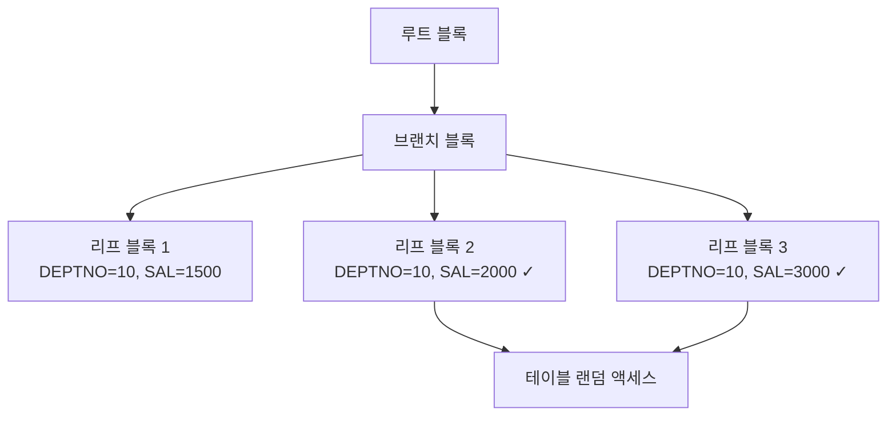

# 인덱스 스캔 방식

인덱스를 읽는 방식은 총 5가지이며, 옵티마이저가 상황에 따라 선택한다.

## 스캔 방식 비교

| 스캔 방식 | 특징 | 선택 조건 |
|-----------|------|-----------|
| Index Range Scan | 범위 스캔, 가장 일반적 | 선두 컬럼 조건 존재 |
| Index Full Scan | 인덱스 전체 읽기 | Table Full Scan보다 유리할 때 |
| Index Unique Scan | 단건 조회 | 유니크 인덱스 + 등치(=) 조건 |
| Index Skip Scan | 선두 컬럼 조건 없이 스캔 | 선두 컬럼 카디널리티 낮을 때 |
| Index Fast Full Scan | 인덱스 블록 전체를 Multi Block I/O | 인덱스만으로 결과 처리 가능 시 |

## Index Range Scan

B-Tree 인덱스에서 **리프 블록을 순서대로** 읽는 방식.

```sql
-- 선두 컬럼(DEPTNO)에 범위 조건 → Index Range Scan
SELECT *
FROM   emp
WHERE  deptno = 10
AND    sal >= 2000;
```



> 💡 **시험 포인트**: Index Range Scan은 선두 컬럼에 `=`, `BETWEEN`, `>=`, `<=`, `LIKE 'A%'` 조건이 있어야 동작한다.

## Index Full Scan

인덱스의 **모든 리프 블록을 처음부터 끝까지** 읽는 방식.

- 선두 컬럼 조건이 없거나 가공되어 Range Scan 불가 시
- Table Full Scan보다 인덱스가 훨씬 작을 때 유리
- **정렬 보장**: 인덱스 컬럼 순서로 정렬된 결과 반환

```sql
-- SAL은 인덱스(DEPTNO, SAL)의 선두가 아님 → Index Full Scan 가능
SELECT ename, sal
FROM   emp
WHERE  sal >= 2000
ORDER BY sal;
```

## Index Unique Scan

유니크 인덱스에서 **단 하나의 레코드**만 조회할 때.

- `=` 조건으로 유니크 인덱스를 탐색
- 해당 레코드를 찾는 즉시 스캔 중단

```sql
-- PK(EMPNO) 인덱스 → Index Unique Scan
SELECT *
FROM   emp
WHERE  empno = 7369;
```

## Index Skip Scan

선두 컬럼 조건 없이도 **후행 컬럼 조건으로** 인덱스를 활용.

- 선두 컬럼의 카디널리티(Distinct 값의 수)가 낮을 때 효과적
- 선두 컬럼 값의 범위를 건너뛰며(Skip) 스캔

```sql
-- 인덱스: (GENDER, SAL) 에서 선두 GENDER 조건 없이 SAL만 조건
SELECT *
FROM   emp
WHERE  sal BETWEEN 2000 AND 3000;
-- GENDER = 'M' 구간, GENDER = 'F' 구간을 각각 Range Scan
```

> ⚠️ GENDER의 Distinct 값이 많으면(카디널리티 높음) Skip Scan 효율 저하.

## Index Fast Full Scan

인덱스 블록을 **Multi Block I/O**로 빠르게 읽는 방식.

- 정렬 보장 없음 (물리적 저장 순서로 읽음)
- 인덱스 컬럼만으로 쿼리 처리 가능할 때 (Table Access 없음)
- 병렬 쿼리 사용 가능

```sql
-- 인덱스(DEPTNO, SAL)만으로 COUNT 처리 → Index Fast Full Scan
SELECT COUNT(*)
FROM   emp
WHERE  deptno IN (10, 20, 30);
```

## 시험 포인트

- **Index Range Scan 실패 케이스**: 인덱스 선두 컬럼에 `함수`, `형변환`, `LIKE '%값'`, `IS NULL` 적용 시
- **Index Full Scan vs Fast Full Scan**: Full은 정렬 보장 O, Fast Full은 정렬 보장 X
- **Skip Scan 조건**: 선두 컬럼 카디널리티 낮음 + 후행 컬럼에 조건 있음
