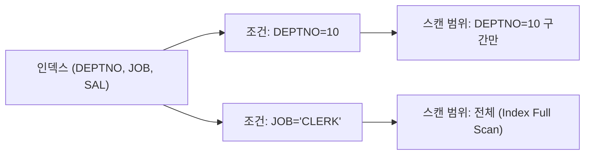

# 인덱스 설계 원칙

## 인덱스 컬럼 선정 기준

| 기준 | 설명 |
|------|------|
| 조건절 사용 빈도 | WHERE 절에 자주 등장하는 컬럼 우선 |
| 카디널리티 | Distinct 값이 많을수록(카디널리티 높을수록) 유리 |
| = 조건 컬럼 우선 | 범위 조건보다 등치 조건 컬럼을 선두에 배치 |
| 정렬/그룹 컬럼 | ORDER BY, GROUP BY에 사용되는 컬럼 고려 |

## 복합 인덱스 컬럼 순서 결정 원칙

```
1. = 조건 컬럼을 앞으로
2. 범위 조건 컬럼을 뒤로
3. 카디널리티 높은 컬럼을 앞으로 (선택도 기준)
4. 자주 사용되는 조건 조합을 커버할 수 있도록
```

### 예시

```sql
-- 쿼리 패턴
SELECT *
FROM   orders
WHERE  status = 'COMPLETED'    -- = 조건
AND    order_date >= '20240101' -- 범위 조건
AND    customer_id = 100;       -- = 조건
```

**최적 인덱스**: `(status, customer_id, order_date)` 또는 `(customer_id, status, order_date)`
- `=` 조건인 status, customer_id를 앞에, 범위 조건인 order_date를 뒤에 배치

> ⚠️ 범위 조건 컬럼 이후의 컬럼은 인덱스 Range Scan에서 필터 조건으로만 작동하여 스캔 범위를 줄이지 못한다.

## 인덱스가 사용되지 않는 경우

### 1. 인덱스 컬럼 가공

```sql
-- ❌ 함수 적용 → 인덱스 Range Scan 불가
SELECT * FROM emp WHERE SUBSTR(ename, 1, 3) = 'SCO';
SELECT * FROM emp WHERE TO_CHAR(hiredate, 'YYYY') = '1981';
SELECT * FROM emp WHERE sal * 1.1 >= 3300;

-- ✅ 컬럼을 가공하지 않도록 조건 변경
SELECT * FROM emp WHERE ename LIKE 'SCO%';
SELECT * FROM emp WHERE hiredate >= TO_DATE('19810101', 'YYYYMMDD')
                    AND hiredate <  TO_DATE('19820101', 'YYYYMMDD');
SELECT * FROM emp WHERE sal >= 3300 / 1.1;
```

### 2. 묵시적 형변환

```sql
-- ❌ 컬럼 타입: VARCHAR2, 조건값: NUMBER → 형변환 발생
SELECT * FROM emp WHERE empno = '7369';  -- empno가 NUMBER면 정상
SELECT * FROM emp WHERE deptno = '10';   -- deptno가 NUMBER면 형변환 없음

-- ❌ 컬럼 타입: NUMBER, 조건값: VARCHAR2 → 인덱스 컬럼에 TO_NUMBER 적용
SELECT * FROM member WHERE phone_no = 01012345678;  -- phone_no VARCHAR2인 경우
```

### 3. IS NULL / IS NOT NULL

```sql
-- ❌ B-Tree 인덱스는 NULL 저장 안 함 → IS NULL 조건에 인덱스 미사용
SELECT * FROM emp WHERE comm IS NULL;

-- ✅ 대안: NULL 대신 특정 값으로 저장하거나 함수 기반 인덱스 사용
SELECT * FROM emp WHERE NVL(comm, 0) = 0;
```

### 4. 부정 조건 (<>, !=, NOT IN, NOT LIKE)

```sql
-- ❌ 부정 조건은 대부분 인덱스 Range Scan 불가
SELECT * FROM emp WHERE deptno <> 10;
SELECT * FROM emp WHERE deptno NOT IN (10, 20);
```

## 인덱스 스캔 효율화

### 선두 컬럼 = 조건으로 스캔 범위 최소화



### 커버링 인덱스 (Covering Index)

테이블 액세스 없이 인덱스만으로 쿼리를 처리하는 설계.

```sql
-- 인덱스: (deptno, ename, sal)
-- 아래 쿼리는 테이블 액세스 없이 인덱스만으로 처리 가능
SELECT ename, sal
FROM   emp
WHERE  deptno = 10;
```

## 시험 포인트

- **범위 조건 컬럼은 인덱스 마지막에**: `ORDER_DATE BETWEEN` 같은 컬럼은 복합 인덱스의 마지막 컬럼에 배치
- **인덱스 컬럼 가공 금지**: WHERE 절에서 인덱스 컬럼에 함수, 연산, 형변환 적용 시 Range Scan 불가
- **커버링 인덱스**: SELECT 절 컬럼까지 인덱스에 포함하면 Table Random Access 제거 가능
