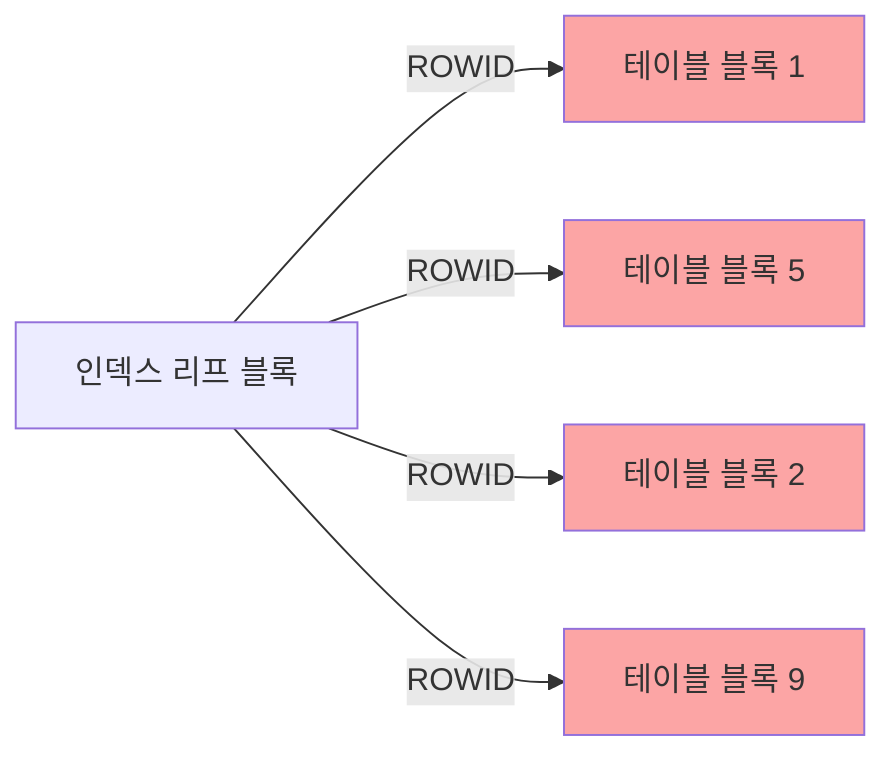

# 테이블 랜덤 액세스 줄이기

인덱스를 사용하더라도 **테이블 랜덤 액세스**(ROWID로 테이블 블록을 하나씩 읽는 것)가 많으면 오히려 Table Full Scan보다 느릴 수 있다.

## 랜덤 액세스 발생 구조



인덱스 리프 블록은 정렬되어 있지만, 가리키는 테이블 블록은 흩어져 있어 **Single Block I/O**가 반복 발생한다.

## 해결 방법 1: 인덱스 컬럼 추가 (커버링 인덱스)

SELECT 절에 필요한 컬럼을 인덱스에 포함시켜 테이블 액세스 자체를 없앤다.

```sql
-- 문제 쿼리: 인덱스(DEPTNO)만 있을 때
SELECT ename, sal, job   -- 테이블 랜덤 액세스 발생
FROM   emp
WHERE  deptno = 10;

-- 해결: 인덱스를 (DEPTNO, ENAME, SAL, JOB)으로 변경
-- → 테이블 액세스 없이 인덱스만으로 처리
```

> ⚠️ 인덱스에 컬럼이 너무 많으면 인덱스 크기 증가 → DML 성능 저하. 트레이드오프 고려 필요.

## 해결 방법 2: 클러스터링 팩터 고려

**클러스터링 팩터(Clustering Factor)**: 인덱스 정렬 순서와 테이블 데이터 저장 순서의 유사도.

| 클러스터링 팩터 | 의미 | 랜덤 액세스 |
|----------------|------|-------------|
| 테이블 블록 수에 가까움 | 인덱스 순서 ≈ 테이블 저장 순서 | 적음 (효율적) |
| 테이블 로우 수에 가까움 | 인덱스 순서 ≠ 테이블 저장 순서 | 많음 (비효율) |

```sql
-- 클러스터링 팩터 확인
SELECT index_name, clustering_factor, num_rows, blocks
FROM   user_indexes
WHERE  table_name = 'EMP';
```

## 해결 방법 3: IOT (Index-Organized Table)

테이블 자체를 인덱스 구조로 저장. 테이블 랜덤 액세스가 원천적으로 없음.

```sql
CREATE TABLE emp_iot (
    empno  NUMBER PRIMARY KEY,
    ename  VARCHAR2(10),
    sal    NUMBER
)
ORGANIZATION INDEX;
```

- PK 기준으로만 검색이 빠름
- PK 이외 컬럼으로 검색 시 오히려 느릴 수 있음

## 해결 방법 4: 인덱스 조건 강화로 스캔 범위 축소

랜덤 액세스 횟수 자체를 줄이는 방법.

```sql
-- ❌ 스캔 범위가 넓어 랜덤 액세스 많음
SELECT *
FROM   orders
WHERE  order_date >= '20240101';   -- 1년치 데이터

-- ✅ 조건 추가로 스캔 범위 축소
SELECT *
FROM   orders
WHERE  order_date >= '20240101'
AND    status = 'PENDING'          -- 인덱스(STATUS, ORDER_DATE) 활용
AND    customer_id = 100;
```

## NL 조인에서 랜덤 액세스

Nested Loop 조인에서 Inner 테이블의 랜덤 액세스가 반복되면 성능이 크게 저하된다.

```sql
-- Outer: DEPT (5건), Inner: EMP
-- EMP에 DEPTNO 인덱스가 없으면 5번 Full Scan 발생!
SELECT d.dname, e.ename
FROM   dept d, emp e
WHERE  d.deptno = e.deptno;

-- EMP(DEPTNO) 인덱스 생성으로 NL 조인 최적화
CREATE INDEX idx_emp_deptno ON emp(deptno);
```

## 시험 포인트

- **랜덤 액세스 = Single Block I/O**: 인덱스를 통한 테이블 접근 방식
- **클러스터링 팩터가 낮을수록** 인덱스 효율 좋음
- **커버링 인덱스**로 랜덤 액세스 자체를 제거하는 것이 가장 효과적
- **NL 조인 Inner 테이블**에는 반드시 조인 컬럼 인덱스 필요
