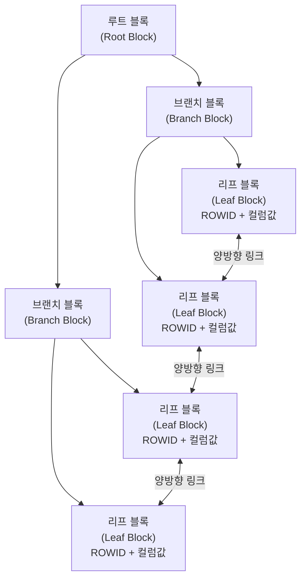

# B-Tree 인덱스 구조

## 구조 개요

B-Tree(Balanced Tree) 인덱스는 Oracle을 포함한 대부분의 RDBMS에서 기본으로 사용하는 인덱스 구조다.



| 구성 요소 | 역할 |
|-----------|------|
| 루트 블록 | 탐색 시작점, 브랜치 블록 포인터 보유 |
| 브랜치 블록 | 리프 블록으로의 경로 안내 |
| 리프 블록 | 실제 인덱스 키 값 + ROWID 저장, 양방향 연결 |

## 인덱스 탐색 원리

### 수직 탐색 (Vertical Scan)
루트 → 브랜치 → 리프까지 내려가며 조건에 맞는 첫 번째 레코드를 찾는 과정.

```
루트 블록: SAL 범위 확인
  → 브랜치 블록: 2000~3000 범위의 리프 블록 포인터
    → 리프 블록: SAL=2000인 첫 번째 레코드 탐색
```

### 수평 탐색 (Horizontal Scan)
리프 블록 간 양방향 링크를 따라 조건에 맞는 모든 레코드를 스캔.

> 💡 **시험 포인트**: 인덱스 탐색은 항상 **수직 탐색 → 수평 탐색** 순서로 진행된다.

## 리프 블록의 ROWID

리프 블록에는 **인덱스 키 값 + ROWID**가 저장된다.

```
ROWID 구조: 오브젝트번호 + 파일번호 + 블록번호 + 로우번호
예) AAAVqNAAEAAAACXAAA
```

- ROWID로 테이블의 정확한 위치를 바로 찾아갈 수 있음
- 인덱스 리프 블록은 키 값 기준으로 **정렬**되어 있음

## 인덱스와 NULL

B-Tree 인덱스는 **NULL 값을 저장하지 않는다.**

```sql
-- comm이 NULL인 사원은 인덱스(COMM)에 존재하지 않음
-- 아래 쿼리는 인덱스 사용 불가
SELECT * FROM emp WHERE comm IS NULL;

-- NULL이 포함된 복합 인덱스의 경우:
-- 모든 컬럼이 NULL이면 인덱스에 저장 안 됨
-- 하나라도 NOT NULL이면 저장됨
```

## 인덱스 종류 비교

| 종류 | 특징 | 적합한 경우 |
|------|------|-------------|
| B-Tree 인덱스 | 범용, 등치/범위 조건 | 카디널리티 높은 컬럼 |
| Bitmap 인덱스 | 비트 연산, DML 성능 저하 | 카디널리티 낮은 컬럼 (성별, 상태코드) |
| 함수 기반 인덱스 | 함수/수식 결과를 인덱싱 | WHERE 절에 함수 적용된 컬럼 |
| 클러스터 인덱스 | 테이블과 인덱스 함께 저장 | 조인 성능 최적화 |

## 시험 포인트

- **리프 블록은 양방향 링크**로 연결 → Range Scan 시 정렬 순서 보장
- **NULL은 인덱스에 저장 안 됨** → IS NULL 조건에 인덱스 미사용
- **수직 탐색 후 수평 탐색**: 인덱스 탐색의 기본 메커니즘
- **Balanced**: 어떤 리프 블록도 루트에서 같은 깊이 → 일관된 성능
