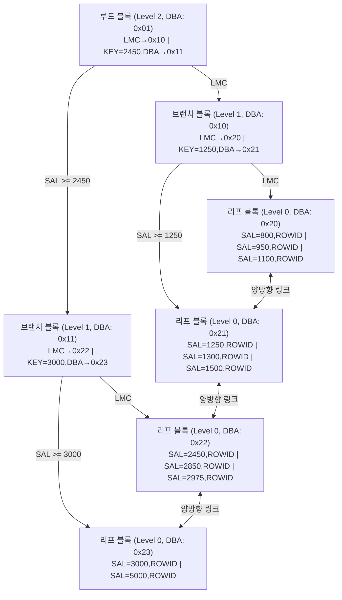

# B-Tree 인덱스 구조

## 구조 개요

B-Tree(Balanced Tree) 인덱스는 Oracle을 포함한 대부분의 RDBMS에서 기본으로 사용하는 인덱스 구조다.
**루트 블록 → 브랜치 블록 → 리프 블록** 3단계 계층으로 이루어지며, 어떤 리프 블록에 도달하더라도 루트에서의 깊이가 동일하다(Balanced).



| 구성 요소 | 역할 |
|-----------|------|
| 루트 블록 | 탐색 시작점. 브랜치 블록 포인터(DBA) 보유 |
| 브랜치 블록 | 리프 블록으로의 경로 안내. 리프 블록 포인터(DBA) 보유 |
| 리프 블록 | 실제 인덱스 키 값 + ROWID 저장. 양방향 링크로 연결 |

---

## 블록 내부 구조

### 루트 블록 / 브랜치 블록

루트 블록과 브랜치 블록은 동일한 내부 구조를 갖는다.
**하위 블록 주소(DBA)**와 **구분 키 값**의 쌍으로 구성되며, 가장 왼쪽에 **LMC(Leftmost Child) 포인터**가 위치한다.

```
+--------------------------------------------------+
| Block Header                                     |
|  블록 타입  : INDEX (브랜치/루트)                |
|  DBA        : 0x01  (이 블록의 주소)             |
|  트리 레벨  : 2 (루트) / 1 (브랜치)              |
|  엔트리 수  : 2                                  |
+--------------------------------------------------+
| LMC (Leftmost Child) Pointer                     |
|  Child DBA: 0x10                                 |
|  → 첫 번째 키(2450)보다 작은 값들이 있는 블록    |
+--------------------------------------------------+
| Index Entry 1                                    |
|  Key Value : 2450                                |
|  Child DBA : 0x11                                |
|  → SAL >= 2450 인 값들이 있는 블록               |
+--------------------------------------------------+
| (추가 엔트리들...)                               |
+--------------------------------------------------+
```

| 구성 요소 | 설명 |
|-----------|------|
| Block Header | 블록 타입, 자신의 DBA, 트리 레벨, 엔트리 수 |
| LMC Pointer | 첫 번째 Key보다 **작은** 모든 값의 하위 블록을 가리키는 특수 포인터 |
| Index Entry | `Key Value + Child DBA` 쌍. 해당 Key **이상**의 값들이 있는 하위 블록을 가리킴 |

> 💡 **LMC(Leftmost Child)**: 루트/브랜치 블록에만 존재하는 특수 포인터.
> 첫 번째 Key Entry보다 작은 값들이 모인 하위 블록을 가리킨다.
> 예) `KEY=2450`이 첫 번째 엔트리라면, LMC는 SAL < 2450 인 모든 값들의 블록을 가리킨다.

---

### 리프 블록

리프 블록은 **실제 인덱스 키 값 + ROWID**를 저장하며, **이전/다음 리프 블록 DBA**를 헤더에 보유해 양방향 링크를 구성한다.

```
+--------------------------------------------------+
| Block Header                                     |
|  블록 타입  : INDEX LEAF                         |
|  DBA        : 0x20  (이 블록의 주소)             |
|  트리 레벨  : 0  (리프는 항상 0)                 |
|  엔트리 수  : 3                                  |
+--------------------------------------------------+
| Prev Leaf DBA : NULL  (첫 번째 리프이므로)       |
| Next Leaf DBA : 0x21  (다음 리프 블록)           |
+--------------------------------------------------+
| Index Entry 1                                    |
|  Key Value : 800                                 |
|  ROWID     : AAAVqNAAEAAAACXAAA                  |
+--------------------------------------------------+
| Index Entry 2                                    |
|  Key Value : 950                                 |
|  ROWID     : AAAVqNAAEAAAACXAAB                  |
+--------------------------------------------------+
| Index Entry 3                                    |
|  Key Value : 1100                                |
|  ROWID     : AAAVqNAAEAAAACXAAC                  |
+--------------------------------------------------+
```

| 구성 요소 | 설명 |
|-----------|------|
| Block Header | 블록 타입, 자신의 DBA, 트리 레벨(=0), 엔트리 수 |
| Prev/Next DBA | 이전/다음 리프 블록 주소 — **Range Scan** 시 수평 탐색에 사용 |
| Index Entry | `Key Value + ROWID` 쌍. ROWID로 테이블 레코드를 직접 접근 |

> 💡 **ROWID 구조**: `오브젝트번호 + 파일번호 + 블록번호 + 로우번호`
> 예) `AAAVqNAAEAAAACXAAA` → 테이블의 정확한 물리 위치를 직접 가리킨다.

---

## 인덱스 탐색 원리

### 수직 탐색 (Vertical Scan)
루트 → 브랜치 → 리프까지 내려가며 조건에 맞는 **첫 번째 레코드**를 찾는 과정.

```
루트 블록 (Level 2): SAL 범위 확인
  KEY=2450 비교 → SAL=2850 >= 2450 → 오른쪽 Child(0x11)로 이동
    브랜치 블록 (Level 1): KEY=3000 비교
      SAL=2850 < 3000 → LMC(0x22)로 이동
        리프 블록 (Level 0): SAL=2850 첫 번째 레코드 발견 → ROWID 획득
```

### 수평 탐색 (Horizontal Scan)
리프 블록 간 **Prev/Next DBA 링크**를 따라 조건에 맞는 모든 레코드를 스캔.

- **등치 조건** (`=`): 해당 키 하나만 찾고 종료
- **범위 조건** (`BETWEEN`, `>=`, `<=`): 시작 리프에서 끝 조건까지 수평 이동

> 💡 **시험 포인트**: 인덱스 탐색은 항상 **수직 탐색 → 수평 탐색** 순서로 진행된다.

---

## 인덱스와 NULL

B-Tree 인덱스는 **NULL 값을 저장하지 않는다.**

```sql
-- comm이 NULL인 사원은 인덱스(COMM)에 존재하지 않음
-- 아래 쿼리는 인덱스 사용 불가
SELECT * FROM emp WHERE comm IS NULL;

-- NULL이 포함된 복합 인덱스의 경우:
-- 모든 컬럼이 NULL이면 인덱스에 저장 안 됨
-- 하나라도 NOT NULL이면 저장됨
```

---

## 인덱스 종류 비교

| 종류 | 특징 | 적합한 경우 |
|------|------|-------------|
| B-Tree 인덱스 | 범용, 등치/범위 조건 | 카디널리티 높은 컬럼 |
| Bitmap 인덱스 | 비트 연산, DML 성능 저하 | 카디널리티 낮은 컬럼 (성별, 상태코드) |
| 함수 기반 인덱스 | 함수/수식 결과를 인덱싱 | WHERE 절에 함수 적용된 컬럼 |
| 클러스터 인덱스 | 테이블과 인덱스 함께 저장 | 조인 성능 최적화 |

---

## 시험 포인트

- **LMC(Leftmost Child)**: 루트/브랜치 블록에만 존재. 첫 번째 Key보다 작은 값들의 하위 블록 포인터
- **리프 블록은 양방향 링크**: Prev/Next DBA → Range Scan 시 정렬 순서 보장
- **NULL은 인덱스에 저장 안 됨** → IS NULL 조건에 인덱스 미사용
- **수직 탐색 후 수평 탐색**: 인덱스 탐색의 기본 메커니즘
- **Balanced**: 어떤 리프 블록도 루트에서 같은 깊이 → 일관된 성능
