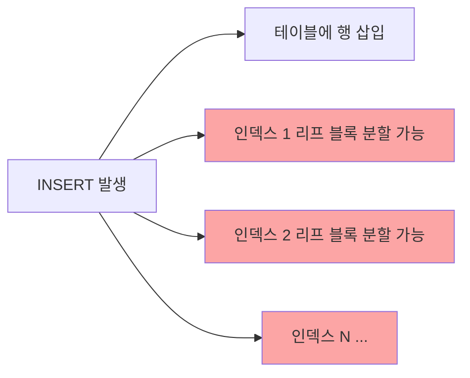

# 인덱스 기본 사용법과 DML 부하

## 인덱스 생성

```sql
-- 단일 컬럼 인덱스
CREATE INDEX idx_emp_deptno ON emp(deptno);

-- 복합 컬럼 인덱스
CREATE INDEX idx_emp_dept_sal ON emp(deptno, sal);

-- 유니크 인덱스
CREATE UNIQUE INDEX idx_emp_empno ON emp(empno);

-- 함수 기반 인덱스
CREATE INDEX idx_emp_upper_ename ON emp(UPPER(ename));
```

## 인덱스 조회

```sql
-- 테이블의 인덱스 목록
SELECT index_name, index_type, uniqueness
FROM   user_indexes
WHERE  table_name = 'EMP';

-- 인덱스 컬럼 구성
SELECT index_name, column_name, column_position
FROM   user_ind_columns
WHERE  table_name = 'EMP'
ORDER BY index_name, column_position;
```

## DML과 인덱스 부하

인덱스는 **조회 성능을 높이지만 DML(INSERT/UPDATE/DELETE) 성능을 저하**시킨다.

### INSERT 시



인덱스 개수만큼 리프 블록 삽입 발생. 블록이 꽉 차면 **블록 분할(Block Split)** 발생.

### UPDATE 시

```sql
-- UPDATE는 인덱스 컬럼 변경 시 Delete + Insert로 처리됨
UPDATE emp SET sal = 3000 WHERE empno = 7369;
-- → 인덱스에서 기존 SAL 값 삭제 표시 + 새 SAL 값 삽입
```

> ⚠️ 인덱스의 UPDATE는 논리적 Delete + Insert → 인덱스 공간 낭비 발생 가능

### DELETE 시

- 테이블 행은 실제 삭제
- 인덱스 리프 블록은 **삭제 표시(Logical Delete)**만 함 → 실제 공간은 즉시 반환 안 됨
- Index Range Scan 시 삭제 표시된 레코드도 읽어야 해서 효율 저하 가능

## 인덱스 재생성

인덱스 삭제/재생성 또는 REBUILD로 공간 정리:

```sql
-- 인덱스 재생성
ALTER INDEX idx_emp_deptno REBUILD;

-- 인덱스 삭제 후 재생성
DROP INDEX idx_emp_deptno;
CREATE INDEX idx_emp_deptno ON emp(deptno);
```

## 시험 포인트

- **인덱스가 많을수록** DML 성능 저하 → 꼭 필요한 인덱스만 생성
- **UPDATE는 Delete + Insert**: 인덱스 컬럼 변경 시 두 번의 인덱스 작업 발생
- **DELETE는 논리적 삭제**: 인덱스 블록의 공간은 즉시 반환되지 않음
- **블록 분할**: INSERT 시 리프 블록이 꽉 차면 발생, 성능 저하 원인
