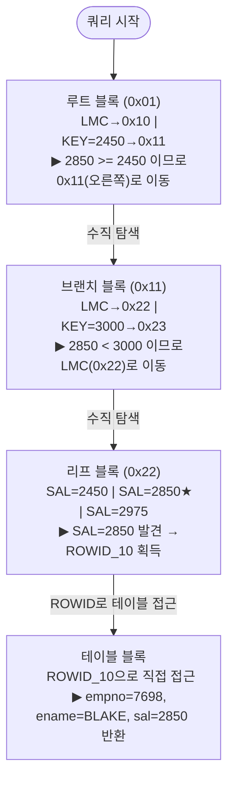
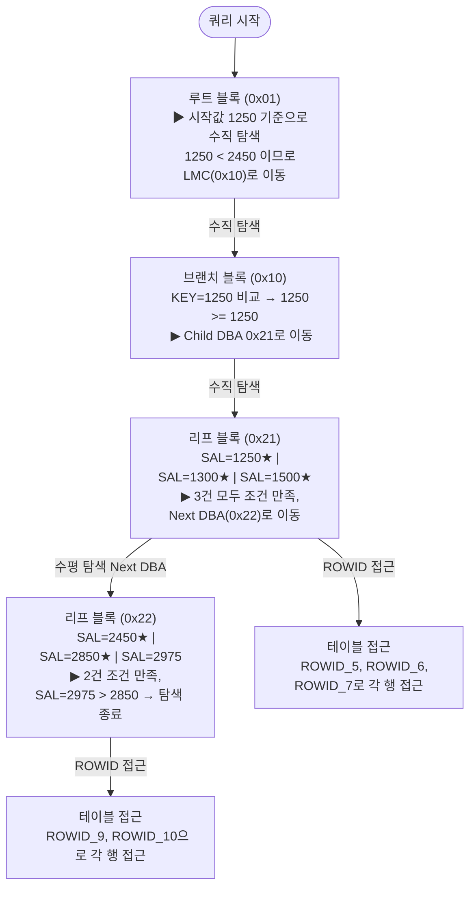

# B-Tree 인덱스 탐색 예시

실제 EMP 테이블과 SAL 인덱스를 이용해 B-Tree 탐색 과정을 단계별로 살펴본다.

---

## 예시 환경

```sql
-- 테이블
CREATE TABLE emp (
    empno  NUMBER PRIMARY KEY,
    ename  VARCHAR2(10),
    job    VARCHAR2(9),
    sal    NUMBER,
    deptno NUMBER
);

-- SAL 컬럼에 B-Tree 인덱스 생성
CREATE INDEX idx_emp_sal ON emp(sal);
```

### 인덱스 구조 (예시)

인덱스가 생성된 시점의 SAL 값과 블록 구조는 아래와 같다고 가정한다.

```
[루트 블록 - Level 2, DBA: 0x01]
  LMC → 0x10
  KEY=2450 → 0x11

[브랜치 블록 - Level 1, DBA: 0x10]          [브랜치 블록 - Level 1, DBA: 0x11]
  LMC → 0x20                                  LMC → 0x22
  KEY=1250 → 0x21                             KEY=3000 → 0x23

[리프 0x20]          [리프 0x21]          [리프 0x22]          [리프 0x23]
 SAL=800,  ROWID_1    SAL=1250, ROWID_5    SAL=2450, ROWID_9    SAL=3000, ROWID_12
 SAL=950,  ROWID_2    SAL=1300, ROWID_6    SAL=2850, ROWID_10   SAL=5000, ROWID_13
 SAL=1100, ROWID_3    SAL=1500, ROWID_7    SAL=2975, ROWID_11
           ←→                  ←→                   ←→
```

---

## 사례 1: 등치 조건 (= 조건)

```sql
SELECT empno, ename, sal
FROM   emp
WHERE  sal = 2850;
```

### 탐색 과정



**단계별 상세 설명:**

| 단계 | 블록 | 동작 |
|------|------|------|
| 1 | 루트 (0x01) | KEY=2450 비교 → 2850 >= 2450 이므로 Child DBA 0x11로 이동 |
| 2 | 브랜치 (0x11) | KEY=3000 비교 → 2850 < 3000 이므로 LMC(0x22)로 이동 |
| 3 | 리프 (0x22) | SAL=2850 엔트리 발견 → ROWID_10 획득 |
| 4 | 테이블 블록 | ROWID_10으로 해당 행 직접 접근, 결과 반환 |
| 5 | 리프 (0x22) | 다음 엔트리(SAL=2975)는 조건 불일치 → 탐색 종료 |

- **블록 I/O**: 루트(1) + 브랜치(1) + 리프(1) + 테이블(1) = **총 4 블록**
- 등치 조건이므로 수평 탐색(리프 블록 이동) 없음

---

## 사례 2: 범위 조건 (BETWEEN)

```sql
SELECT empno, ename, sal
FROM   emp
WHERE  sal BETWEEN 1250 AND 2850;
```

### 탐색 과정



**단계별 상세 설명:**

| 단계 | 블록 | 동작 |
|------|------|------|
| 1 | 루트 (0x01) | 시작값 1250 기준 탐색 → 1250 < 2450 이므로 LMC(0x10)로 이동 |
| 2 | 브랜치 (0x10) | KEY=1250 비교 → 1250 >= 1250 이므로 Child DBA 0x21로 이동 |
| 3 | 리프 (0x21) | SAL=1250, 1300, 1500 모두 조건 만족 → 각 ROWID로 테이블 접근 |
| 4 | 리프 (0x22) | Next DBA 링크로 이동. SAL=2450, 2850 조건 만족 → 테이블 접근 |
| 5 | 리프 (0x22) | SAL=2975 > 2850 → 범위 초과, 탐색 종료 |

- **블록 I/O**: 루트(1) + 브랜치(1) + 리프(2) + 테이블(5) = **총 9 블록**
- **수직 탐색**: 시작값(1250)으로 첫 리프 블록 결정
- **수평 탐색**: Next DBA를 따라 리프 블록 이동 (0x21 → 0x22)

---

## 사례 3: 인덱스 미사용 케이스

```sql
-- 인덱스(idx_emp_sal)가 있어도 사용하지 않는 경우

-- (1) 함수 사용 → 인덱스 컬럼 변형
SELECT * FROM emp WHERE ROUND(sal) = 2850;

-- (2) 묵시적 형변환
SELECT * FROM emp WHERE sal = '2850';  -- sal이 NUMBER인데 VARCHAR로 비교

-- (3) IS NULL 조건 → B-Tree에 NULL 저장 안 됨
SELECT * FROM emp WHERE sal IS NULL;

-- (4) 부정형 조건 → 인덱스 Range Scan 불가 (Full Scan으로 처리)
SELECT * FROM emp WHERE sal <> 2850;
```

| 케이스 | 이유 |
|--------|------|
| 함수 사용 `ROUND(sal)` | 인덱스는 SAL 원본값으로 저장. 함수 결과값이 없어 사용 불가 |
| 묵시적 형변환 | 내부적으로 `TO_NUMBER(sal)`이 적용되어 인덱스 컬럼 변형과 동일 |
| `IS NULL` | B-Tree 인덱스에 NULL 미저장 → 인덱스 탐색 불가 |
| `<>` 부정형 | 범위를 특정할 수 없어 Range Scan 불가 → Full Table Scan |

---

## 핵심 정리

```
B-Tree 탐색 순서:
  ① 수직 탐색: 루트 → 브랜치 → 리프 (조건에 맞는 첫 레코드 위치 결정)
  ② 수평 탐색: 리프 블록 간 Prev/Next 링크로 범위 내 모든 레코드 스캔
  ③ 테이블 접근: 각 ROWID로 테이블 블록에 Random Access

효율적인 인덱스 사용 조건:
  - 인덱스 컬럼에 함수/연산 미적용
  - 등치(=) 또는 범위(BETWEEN, >, <) 조건
  - 선두 컬럼 조건 존재 (복합 인덱스)
```
