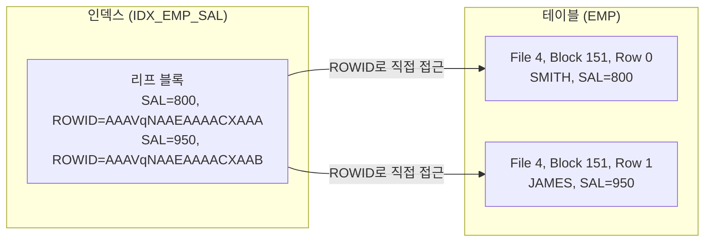

# ROWID 구조와 활용

ROWID는 테이블 내 각 행(Row)의 **물리적 위치**를 나타내는 Oracle 고유의 식별자다.
인덱스 리프 블록에 저장되어 있으며, ROWID를 통해 테이블 블록에 **단 1번의 I/O**로 직접 접근할 수 있다.

---

## Extended ROWID 형식 (Oracle 8 이상)

Oracle 8부터 도입된 **Extended ROWID**는 18자리 Base64 문자열로 구성된다.

```
예시: AAAVqNAAEAAAACXAAA
      ──────────────────
      OOOOOO FFF BBBBBB RRR
```

| 구성 요소 | 자릿수 | 비트 수 | 설명 |
|-----------|--------|---------|------|
| **OOOOOO** | 6자리 | 32 bit | 데이터 오브젝트 번호 (Object Number) |
| **FFF** | 3자리 | 10 bit | 테이블스페이스 내 상대적 파일 번호 (Relative File Number) |
| **BBBBBB** | 6자리 | 22 bit | 파일 내 블록 번호 (Block Number) |
| **RRR** | 3자리 | 16 bit | 블록 내 행 번호 (Row Number, 0부터 시작) |

```
AAAVqN  AAE  AAAACX  AAA
──────  ───  ──────  ───
Object  File  Block  Row
  #      #      #     #
```

> 💡 **Base64 인코딩**: A~Z(0~25), a~z(26~51), 0~9(52~61), +(62), /(63) — 문자 1개당 6비트 표현

---

## Restricted ROWID (Oracle 7 이하)

Oracle 7까지 사용된 구식 형식. 단일 테이블스페이스를 가정해 파일번호를 절대값으로 저장했다.

```
형식: BBBBBBBB.RRRR.FFFF
예시: 00000D2F.0000.0005
      ────────  ────  ────
       Block    Row   File
        #        #     #
(16진수 표기)
```

현재는 사용하지 않으므로 **Extended ROWID** 형식을 기준으로 학습한다.

---

## ROWID 직접 조회

```sql
-- 테이블에서 ROWID 조회
SELECT ROWID, empno, ename, sal
FROM   emp;

-- 결과 예시
-- ROWID              EMPNO  ENAME   SAL
-- -----------------  -----  ------  ----
-- AAAVqNAAEAAAACXAAA  7369   SMITH   800
-- AAAVqNAAEAAAACXAAB  7499   ALLEN   1600
-- AAAVqNAAEAAAACXAAC  7521   WARD    1250
```

```sql
-- 특정 ROWID로 행 직접 조회 (가장 빠른 단건 조회)
SELECT *
FROM   emp
WHERE  ROWID = 'AAAVqNAAEAAAACXAAA';
```

---

## DBMS_ROWID 패키지로 ROWID 분석

Oracle은 `DBMS_ROWID` 패키지를 통해 ROWID의 각 구성 요소를 추출할 수 있다.

```sql
SELECT ROWID,
       DBMS_ROWID.ROWID_OBJECT(ROWID)          AS object_no,   -- 오브젝트 번호
       DBMS_ROWID.ROWID_RELATIVE_FNO(ROWID)    AS file_no,     -- 상대 파일 번호
       DBMS_ROWID.ROWID_BLOCK_NUMBER(ROWID)    AS block_no,    -- 블록 번호
       DBMS_ROWID.ROWID_ROW_NUMBER(ROWID)      AS row_no       -- 행 번호
FROM   emp
WHERE  ename = 'SMITH';
```

```
-- 결과 예시
ROWID               OBJECT_NO  FILE_NO  BLOCK_NO  ROW_NO
------------------  ---------  -------  --------  ------
AAAVqNAAEAAAACXAAA     88397       4       151       0
```

**해석:**
- `AAAVqN` → Object# 88397 (EMP 테이블 오브젝트 번호)
- `AAE` → File# 4 (4번 데이터 파일)
- `AAAACX` → Block# 151 (4번 파일의 151번 블록)
- `AAA` → Row# 0 (151번 블록의 첫 번째 행, 0부터 카운트)

---

## ROWID와 인덱스 탐색



ROWID가 있으면 **파일번호 → 블록번호 → 행번호** 순으로 즉시 접근하므로,
테이블 전체를 스캔하지 않고 **정확한 블록 1개**만 읽으면 된다.

---

## ROWID 활용 — 중복 제거

ROWID는 테이블에서 **동일 값 중 특정 행만 남기는** 경우에 유용하게 활용된다.

```sql
-- 중복 행 중 ROWID가 가장 작은(또는 큰) 행 1개만 남기고 나머지 삭제
DELETE FROM emp e
WHERE  ROWID > (
    SELECT MIN(ROWID)
    FROM   emp
    WHERE  empno = e.empno  -- 동일 기준 컬럼
);
```

---

## ROWID 관련 주의사항

| 상황 | ROWID 변경 여부 |
|------|----------------|
| 행 UPDATE (일반 컬럼 수정) | **변경 안 됨** — 같은 블록에서 수정 |
| 행 DELETE 후 INSERT | **변경됨** — 새 위치에 삽입 |
| 테이블 MOVE / 파티션 이동 | **변경됨** — 블록 위치 재배치 |
| 테이블 EXPORT/IMPORT | **변경됨** — 재적재 |
| `ALTER TABLE ... SHRINK SPACE` | **변경됨** — 블록 재구성 |

> ⚠️ **주의**: 애플리케이션에서 ROWID를 저장해두고 나중에 사용하는 패턴은 위험하다.
> 테이블 재구성 시 ROWID가 변경되어 잘못된 행을 가리키거나 오류가 발생할 수 있다.

---

## 시험 포인트

- **Extended ROWID = 18자리 Base64** = `오브젝트번호(6) + 파일번호(3) + 블록번호(6) + 행번호(3)`
- **행 번호는 0부터 시작** (Row# 0 = 해당 블록의 첫 번째 행)
- **ROWID로 단건 조회**가 가장 빠른 접근법 — 인덱스 Range Scan 후 테이블 Random Access 시 사용
- **테이블 MOVE, 파티션 이동 시 ROWID 변경** → 인덱스 재생성 필요
- `DBMS_ROWID` 패키지로 오브젝트번호/파일번호/블록번호/행번호 분리 추출 가능
