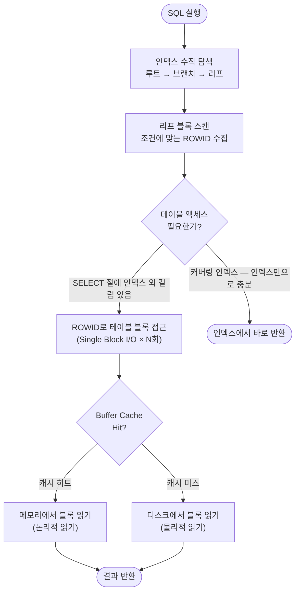
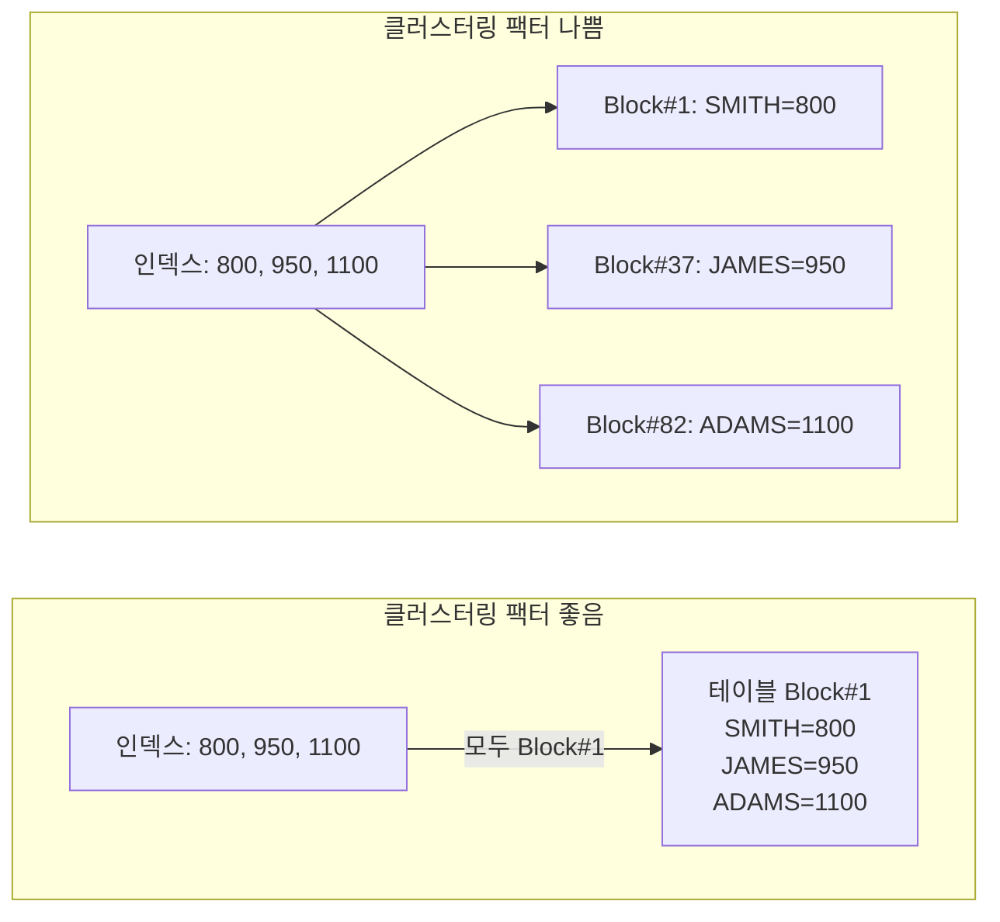

# ROWID 활용 테이블 액세스

인덱스를 통한 테이블 접근의 핵심 메커니즘은 **ROWID를 이용한 Single Block I/O**다.
이 과정이 어떻게 작동하는지, 언제 비효율이 발생하는지, 어떻게 최소화하는지를 상세히 살펴본다.

---

## 테이블 액세스 전체 흐름



---

## ROWID 기반 Single Block I/O 상세

인덱스를 통한 테이블 접근은 ROWID당 **1번의 Single Block I/O**가 발생한다.
Full Scan의 Multi Block I/O(한 번에 여러 블록 읽기)와 달리 비효율적인 접근 방식이다.

```
인덱스 리프 블록 (정렬 상태)           테이블 블록 (흩어져 있음)
┌─────────────────────┐               ┌──────────┐ Block #1
│ SAL=800,  ROWID_A  │──────────────▶│ SMITH    │ (1회 I/O)
│ SAL=950,  ROWID_B  │──────┐        └──────────┘
│ SAL=1100, ROWID_C  │───┐  │        ┌──────────┐ Block #5
│ SAL=1250, ROWID_D  │─┐ │  └───────▶│ JAMES    │ (1회 I/O)
└─────────────────────┘ │ │          └──────────┘
                        │ │          ┌──────────┐ Block #2
                        │ └─────────▶│ ADAMS    │ (1회 I/O)
                        │            └──────────┘
                        │            ┌──────────┐ Block #7
                        └───────────▶│ WARD     │ (1회 I/O)
                                     └──────────┘
※ ROWID 4개 → 테이블 블록 4곳 각각 1회씩 I/O 발생
```

| 구분 | Single Block I/O | Multi Block I/O |
|------|-----------------|-----------------|
| 발생 상황 | 인덱스를 통한 테이블 접근 | Full Table Scan |
| 읽기 단위 | 블록 1개 | db_file_multiblock_read_count 블록 수 |
| 적합한 경우 | 소량 데이터 랜덤 접근 | 대량 데이터 순차 접근 |
| I/O 방식 | Random I/O | Sequential I/O |

---

## Buffer Cache와 ROWID 액세스

Oracle은 데이터 블록을 디스크에서 읽으면 **Buffer Cache**에 보관한다.
동일 블록에 대한 재접근은 메모리에서 처리되므로(논리적 읽기), 물리적 디스크 I/O가 줄어든다.

```sql
-- 논리적 읽기(Buffer Gets)와 물리적 읽기(Disk Reads) 확인
SELECT sql_text,
       buffer_gets,       -- 논리적 읽기 횟수 (Buffer Cache 포함)
       disk_reads,        -- 물리적 디스크 읽기 횟수
       executions,
       ROUND(buffer_gets / DECODE(executions, 0, 1, executions)) AS gets_per_exec
FROM   v$sql
WHERE  sql_text LIKE '%WHERE sal%'
ORDER BY buffer_gets DESC;
```

```
시나리오 비교:

[클러스터링 팩터 좋음] → 같은 블록에 여러 ROWID가 몰려 있음
  ROWID_1, ROWID_2, ROWID_3 → 모두 Block #1 → 1회 I/O로 3건 처리
  Buffer Cache 재사용 효과 극대화

[클러스터링 팩터 나쁨] → ROWID마다 다른 블록
  ROWID_1 → Block #1  (1회 I/O)
  ROWID_2 → Block #37 (1회 I/O)
  ROWID_3 → Block #82 (1회 I/O)
  매번 새 블록 읽기 → 물리적 I/O 증가
```

---

## 클러스터링 팩터와 액세스 효율

**클러스터링 팩터(Clustering Factor)**: 인덱스의 정렬 순서와 테이블의 실제 저장 순서가 얼마나 일치하는지를 나타내는 값.

```sql
-- 클러스터링 팩터 조회
SELECT index_name,
       clustering_factor,
       num_rows,
       blocks,
       ROUND(clustering_factor / blocks, 1) AS cf_ratio  -- 1에 가까울수록 좋음
FROM   user_indexes
WHERE  table_name = 'EMP';
```

```
clustering_factor 해석:

  blocks 수에 가까움 (예: blocks=100, CF=110)
  → 인덱스 순서 ≈ 테이블 저장 순서
  → 연속된 인덱스 엔트리가 같은 테이블 블록에 위치
  → ROWID 액세스 시 블록 재사용 ↑, I/O ↓  (효율적)

  rows 수에 가까움 (예: rows=10000, CF=9800)
  → 인덱스 순서 ≠ 테이블 저장 순서
  → 연속된 인덱스 엔트리가 모두 다른 블록에 분산
  → ROWID 액세스마다 새 블록 읽기 → I/O ↑  (비효율적)
```



---

## 손익 분기점: 인덱스 vs Full Scan

ROWID 액세스 비율이 일정 수준을 넘으면 Full Table Scan이 오히려 유리하다.

```
일반적인 손익 분기점: 전체 데이터의 약 10~20%

예) EMP 테이블 10,000건, 블록 200개

  SAL > 1000 조건 → 해당 건수: 8,000건 (80%)
  → 인덱스 경유 시: 8,000번 Single Block I/O 발생 가능
  → Full Scan 시: 200블록 Multi Block I/O → 훨씬 적은 I/O
  ∴ 옵티마이저가 Full Scan 선택

  SAL > 4500 조건 → 해당 건수: 50건 (0.5%)
  → 인덱스 경유 시: 최대 50번 Single Block I/O
  → Full Scan 보다 훨씬 적은 I/O
  ∴ 옵티마이저가 인덱스 선택
```

```sql
-- 옵티마이저의 선택 확인 (실행 계획)
EXPLAIN PLAN FOR
SELECT * FROM emp WHERE sal > 1000;

SELECT * FROM TABLE(DBMS_XPLAN.DISPLAY);

-- 인덱스 사용 시: INDEX RANGE SCAN + TABLE ACCESS BY INDEX ROWID
-- Full Scan 시: TABLE ACCESS FULL
```

---

## TABLE ACCESS BY INDEX ROWID 실행 계획 분석

```sql
-- 실행 계획 예시
SELECT empno, ename, sal, deptno
FROM   emp
WHERE  sal BETWEEN 1000 AND 3000;
```

```
실행 계획:
-----------------------------------------------------------
| Id | Operation                    | Name         | Rows |
-----------------------------------------------------------
|  0 | SELECT STATEMENT             |              |    9 |
|  1 |  TABLE ACCESS BY INDEX ROWID | EMP          |    9 |
|  2 |   INDEX RANGE SCAN           | IDX_EMP_SAL  |    9 |
-----------------------------------------------------------

읽기 순서:
  ① Id=2: IDX_EMP_SAL 인덱스에서 SAL 1000~3000 범위 스캔 → ROWID 목록 반환
  ② Id=1: 각 ROWID로 EMP 테이블 블록 접근 → 나머지 컬럼(DEPTNO 등) 조회

TABLE ACCESS BY INDEX ROWID BATCHED (Oracle 12c 이상):
  ROWID를 배치로 모아서 블록 순서대로 정렬 후 접근 → 물리적 I/O 감소
```

---

## ROWID 액세스 최소화 전략

### 전략 1: 커버링 인덱스 (Index Only Scan)

```sql
-- 문제: 테이블 액세스 발생
-- 인덱스: IDX_EMP_SAL(SAL)
SELECT empno, ename, sal   -- empno, ename은 인덱스에 없음 → 테이블 접근 필요
FROM   emp
WHERE  sal BETWEEN 1000 AND 3000;

-- 해결: 인덱스에 컬럼 추가
CREATE INDEX idx_emp_sal_cover ON emp(sal, empno, ename);
-- → SELECT 컬럼 전부 인덱스에 포함 → 테이블 접근 없음 (INDEX RANGE SCAN만)
```

### 전략 2: 인덱스 선두 컬럼 조건 강화

```sql
-- 선두 컬럼에 조건을 추가해 스캔 범위(= ROWID 수)를 줄임
-- 인덱스: IDX_EMP_DEPT_SAL(DEPTNO, SAL)
SELECT *
FROM   emp
WHERE  deptno = 10               -- 선두 컬럼 조건 (스캔 범위 대폭 축소)
AND    sal BETWEEN 1000 AND 3000;
```

### 전략 3: 배치 처리 시 ROWID 정렬

```sql
-- 대량 UPDATE 시 ROWID 정렬로 블록 I/O 최소화
-- (같은 블록의 ROWID끼리 모아서 처리 → 블록 재사용)
BEGIN
    FOR r IN (
        SELECT ROWID AS rid, sal
        FROM   emp
        WHERE  deptno = 10
        ORDER BY ROWID   -- ← 블록 순서로 정렬
    ) LOOP
        UPDATE emp
        SET    sal = r.sal * 1.1
        WHERE  ROWID = r.rid;
    END LOOP;
END;
```

### 전략 4: TABLE ACCESS BY INDEX ROWID BATCHED 활용 (Oracle 12c+)

Oracle 12c부터 옵티마이저가 자동으로 ROWID를 배치로 모아 블록 순서대로 접근한다.

```sql
-- 힌트로 명시적 제어 가능
SELECT /*+ ROWID(e) */ *
FROM   emp e
WHERE  sal > 2000;

-- 실행 계획에 "TABLE ACCESS BY INDEX ROWID BATCHED" 표시
-- → 여러 ROWID를 수집한 뒤 블록 순서로 정렬하여 접근 → I/O 효율 향상
```

---

## 시험 포인트

- **ROWID 액세스 = Single Block I/O**: ROWID 1개당 테이블 블록 1회 읽기
- **클러스터링 팩터가 낮을수록** ROWID 액세스 효율 좋음 (블록 재사용 ↑)
- **손익 분기점**: 전체 데이터의 약 10~20% 초과 조회 시 Full Scan이 유리
- **커버링 인덱스**: 테이블 액세스(ROWID 접근) 자체를 없애는 가장 효과적인 방법
- **TABLE ACCESS BY INDEX ROWID BATCHED** (12c+): 자동으로 ROWID 정렬 후 접근하여 효율 향상
- **논리적 읽기 vs 물리적 읽기**: Buffer Cache Hit 여부가 실제 성능에 결정적 영향
