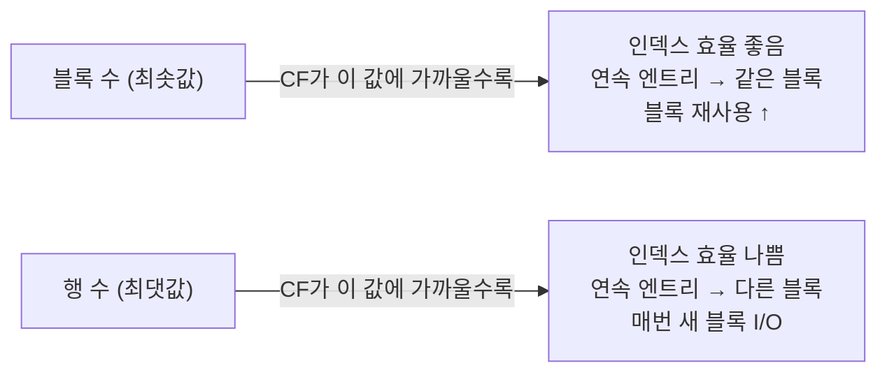
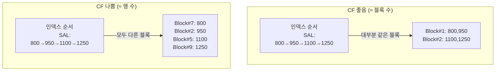
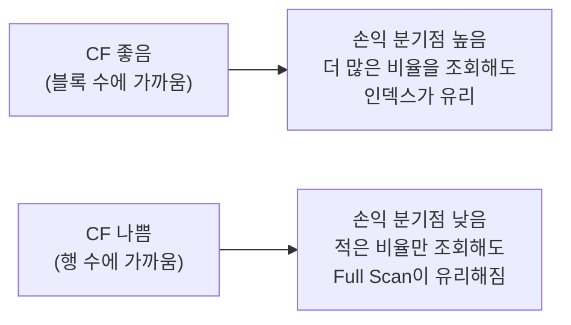

# 인덱스 클러스터링 팩터와 손익 분기점

---

## 클러스터링 팩터 (Clustering Factor)

**클러스터링 팩터(CF)**란 인덱스의 정렬 순서와 테이블의 실제 저장 순서가 얼마나 일치하는지를 나타내는 수치다.
옵티마이저가 인덱스 사용 여부를 결정할 때 핵심 비용 지표로 활용한다.

### 계산 방식

Oracle은 인덱스를 처음부터 끝까지 스캔하면서 아래 규칙으로 CF를 계산한다.

```
① 인덱스 리프 블록을 순서대로 읽는다.
② 인접한 두 인덱스 엔트리가 가리키는 테이블 블록이 다르면 카운트 +1
③ 같은 블록이면 카운트 유지
④ 전체 스캔 후 누적된 카운트 = Clustering Factor
```

```
예시) 인덱스(SAL) 스캔 중 테이블 블록 접근 추적:

엔트리 1: SAL=800  → Block #1  (시작)
엔트리 2: SAL=950  → Block #1  → 블록 동일: CF +0
엔트리 3: SAL=1100 → Block #3  → 블록 변경: CF +1
엔트리 4: SAL=1250 → Block #1  → 블록 변경: CF +1  ← 이전에 방문했어도 카운트
엔트리 5: SAL=1300 → Block #3  → 블록 변경: CF +1
엔트리 6: SAL=1500 → Block #2  → 블록 변경: CF +1
                                           CF = 4

테이블 블록 수 = 3, 테이블 전체 행 수 = 6
CF(4)가 블록 수(3)에 가까움 → 클러스터링 상태 양호
```

### CF 범위와 의미



| CF 값 | 의미 | ROWID 접근 효율 |
|-------|------|----------------|
| ≈ 블록 수 | 인덱스 순서 ≈ 테이블 저장 순서 | 높음 (블록 재사용) |
| ≈ 행 수 | 인덱스 순서 ≠ 테이블 저장 순서 | 낮음 (매번 새 블록) |

### 시각적 비교



### CF 조회 방법

```sql
-- 인덱스별 클러스터링 팩터 조회
SELECT index_name,
       clustering_factor          AS cf,
       num_rows,
       blocks,
       ROUND(clustering_factor / blocks, 1) AS cf_per_block,  -- 1에 가까울수록 좋음
       ROUND(clustering_factor / num_rows * 100, 1) AS cf_pct -- 낮을수록 좋음
FROM   user_indexes
WHERE  table_name = 'EMP'
ORDER BY clustering_factor;

-- CF가 num_rows에 가깝고 cf_pct가 높으면 인덱스 효율 의심
```

### CF 개선 방법

```sql
-- CF를 개선하려면 테이블 데이터를 인덱스 순서로 재정렬해야 한다.
-- 방법 1: 테이블 재생성 (인덱스 컬럼 기준 정렬 INSERT)
CREATE TABLE emp_new AS
SELECT * FROM emp ORDER BY sal;  -- 인덱스(SAL) 순서로 재저장

-- 방법 2: ALTER TABLE ... MOVE (단, 인덱스 재생성 필요)
ALTER TABLE emp MOVE;

-- 방법 3: DBMS_REDEFINITION (무중단 재정의, 운영 환경)
```

> ⚠️ CF는 테이블에 INSERT/UPDATE가 반복되면 점점 나빠진다.
> 주기적인 통계 갱신과 테이블 재구성이 필요하다.

---

## 손익 분기점 (Break-Even Point)

**손익 분기점**이란 인덱스 스캔과 Full Table Scan의 비용이 같아지는 지점이다.
이 비율을 넘으면 옵티마이저가 Full Scan을 선택한다.

### 기본 원리

```
Full Table Scan 비용 = 테이블 블록 수 / db_file_multiblock_read_count
인덱스 경유 비용    = 인덱스 블록 I/O + (ROWID 액세스 수 × 1 Single Block I/O)

손익 분기점 = Full Scan 비용 ÷ 전체 행 수
```

실제로는 CF에 따라 달라지지만, 일반적으로 **전체 데이터의 5~20%** 수준이 기준이다.

### CF에 따른 손익 분기점 차이

```
[CF 좋음 — 블록 재사용 높음]
  인덱스를 통해 30%의 데이터를 조회해도 블록 재사용으로 I/O가 적을 수 있음
  → 손익 분기점이 상대적으로 높음 (인덱스가 유리한 범위 넓음)

[CF 나쁨 — 블록 재사용 거의 없음]
  인덱스를 통해 5%만 조회해도 ROWID마다 다른 블록 → Full Scan과 비슷한 I/O
  → 손익 분기점이 낮음 (Full Scan이 빠르게 유리해짐)
```

### 구체적 계산 예시

```
테이블 조건:
  전체 행 수    : 100,000건
  테이블 블록 수: 1,000블록
  db_file_multiblock_read_count: 8

Full Table Scan 비용 = 1,000 / 8 = 125 (I/O 단위)

[CF 좋음, CF = 1,200]
  3,000건(3%) 조회 시 예상 블록 I/O ≈ 1,200 × 0.03 = 36 → 인덱스 유리
  15,000건(15%) 조회 시 예상 블록 I/O ≈ 1,200 × 0.15 = 180 > 125 → Full Scan 유리
  ∴ 손익 분기점 ≈ 10% 수준

[CF 나쁨, CF = 90,000]
  3,000건(3%) 조회 시 예상 블록 I/O ≈ 90,000 × 0.03 = 2,700 > 125 → Full Scan 유리
  ∴ 손익 분기점 ≈ 0.1% 수준 (인덱스가 거의 무용지물)
```

### 실행 계획으로 확인

```sql
-- 비율별 옵티마이저 선택 관찰
-- (통계가 정확하게 수집되어 있어야 함)

-- 소량 조회 → 인덱스 선택 예상
EXPLAIN PLAN FOR
SELECT * FROM emp WHERE sal > 4000;  -- 1건 해당
SELECT * FROM TABLE(DBMS_XPLAN.DISPLAY);
-- → INDEX RANGE SCAN + TABLE ACCESS BY INDEX ROWID

-- 대량 조회 → Full Scan 선택 예상
EXPLAIN PLAN FOR
SELECT * FROM emp WHERE sal > 500;   -- 전체의 90% 해당
SELECT * FROM TABLE(DBMS_XPLAN.DISPLAY);
-- → TABLE ACCESS FULL
```

### 힌트로 강제 제어

```sql
-- 옵티마이저가 Full Scan을 선택했지만 인덱스 강제 사용
SELECT /*+ INDEX(e IDX_EMP_SAL) */ *
FROM   emp e
WHERE  sal > 1000;

-- 반대로 인덱스 사용을 막고 Full Scan 강제
SELECT /*+ FULL(e) */ *
FROM   emp e
WHERE  sal > 4000;
```

> 💡 힌트는 임시 방편이다. 통계 정보가 오래되었거나 CF가 잘못 계산된 경우 힌트 대신
> **통계 갱신(`DBMS_STATS.GATHER_TABLE_STATS`)**을 먼저 수행한다.

---

## CF와 손익 분기점의 관계 정리



| 상황 | CF | 손익 분기점 | 인덱스 효용성 |
|------|----|------------|--------------|
| 입력 순서 ≈ SAL 오름차순 | 낮음(좋음) | 높음(~20%) | 높음 |
| 무작위 입력 | 높음(나쁨) | 낮음(~1%) | 낮음 |
| INSERT 후 DELETE 반복 | 점점 나빠짐 | 점점 낮아짐 | 저하 |

---

## 시험 포인트

- **CF 계산**: 인덱스 순서 스캔 중 인접 엔트리가 다른 테이블 블록을 가리킬 때마다 +1
- **CF 최솟값 ≈ 블록 수**: 최선. **CF 최댓값 ≈ 행 수**: 최악
- **CF는 통계 정보에 저장** → `USER_INDEXES.CLUSTERING_FACTOR`로 확인
- **손익 분기점은 고정값이 아님**: CF, 블록 크기, `db_file_multiblock_read_count` 등에 따라 달라짐
- **CF가 나쁘면 손익 분기점이 낮아짐** → 인덱스가 거의 사용되지 않음
- **개선 방법**: 테이블 재정렬(MOVE, 재생성), 클러스터 테이블, IOT 활용
