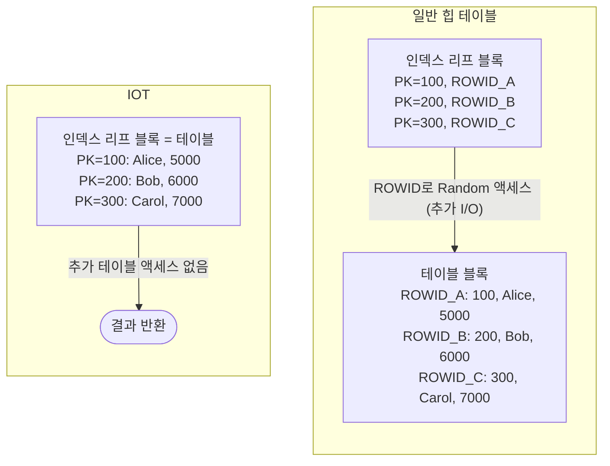
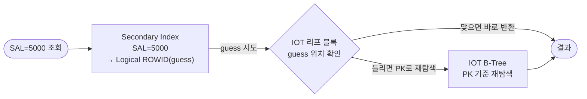

# IOT (Index-Organized Table)

**IOT(Index-Organized Table)**는 테이블 데이터 자체를 B-Tree 인덱스 구조 안에 저장하는 방식이다.
일반 힙(Heap) 테이블과 달리 별도의 테이블 블록이 없으며, **테이블 랜덤 액세스가 원천적으로 발생하지 않는다.**

---

## 일반 힙 테이블 vs IOT 구조 비교



| 구분 | 힙 테이블 | IOT |
|------|-----------|-----|
| 데이터 저장 위치 | 별도 테이블 세그먼트 | B-Tree 리프 블록 |
| PK 조회 방식 | 인덱스 → ROWID → 테이블 (2단계) | B-Tree 리프 블록 직접 반환 (1단계) |
| ROWID | 물리적 ROWID (고정) | 논리적 ROWID (PK 기반) |
| 데이터 정렬 | 입력 순서 (무작위) | **항상 PK 기준으로 정렬** |
| 저장 세그먼트 | 테이블 + 인덱스 2개 | B-Tree 1개 (인덱스 = 테이블) |

---

## IOT 생성

```sql
-- 기본 IOT 생성 (ORGANIZATION INDEX 키워드)
CREATE TABLE emp_iot (
    empno   NUMBER(4)    NOT NULL,
    ename   VARCHAR2(10),
    job     VARCHAR2(9),
    sal     NUMBER(7, 2),
    deptno  NUMBER(2),
    CONSTRAINT pk_emp_iot PRIMARY KEY (empno)   -- PK 필수
)
ORGANIZATION INDEX;   -- ← 핵심 키워드
```

```sql
-- PCTTHRESHOLD + OVERFLOW 옵션 (큰 행 처리)
CREATE TABLE emp_iot (
    empno   NUMBER(4)    NOT NULL,
    ename   VARCHAR2(10),
    job     VARCHAR2(9),
    sal     NUMBER(7, 2),
    deptno  NUMBER(2),
    memo    VARCHAR2(4000),    -- 큰 컬럼
    CONSTRAINT pk_emp_iot PRIMARY KEY (empno)
)
ORGANIZATION INDEX
PCTTHRESHOLD 20              -- 블록의 20% 초과하는 행은 OVERFLOW로
OVERFLOW TABLESPACE users;   -- OVERFLOW 세그먼트 위치
```

---

## IOT 내부 구조

IOT의 리프 블록에는 인덱스 키(PK)와 나머지 컬럼 데이터가 함께 저장된다.

```
[IOT B-Tree 구조]

루트 블록 (Level 2)
  └─ 브랜치 블록 (Level 1)
       ├─ 리프 블록 A (Level 0)  ← 여기에 실제 데이터가 있음
       │   PK=100: Alice, Clerk, 5000, 10
       │   PK=150: Dave,  Mgr,   7500, 20
       │   PK=200: Bob,   Clerk, 6000, 10
       │
       └─ 리프 블록 B (Level 0)
           PK=300: Carol, Analyst, 9000, 30
           PK=400: Eve,   Salesman, 4000, 30
           PK=500: Frank, President, 15000, 10
```

```
리프 블록 내부:
+--------------------------------------------------+
| Block Header (IOT LEAF)                          |
+--------------------------------------------------+
| Prev Leaf DBA | Next Leaf DBA                    |
+--------------------------------------------------+
| Row 1: PK=100 | ENAME=Alice | JOB=Clerk | SAL=5000 | DEPTNO=10 |
+--------------------------------------------------+
| Row 2: PK=200 | ENAME=Bob   | JOB=Clerk | SAL=6000 | DEPTNO=10 |
+--------------------------------------------------+
| Row 3: PK=300 | ENAME=Carol | JOB=Analyst | SAL=9000 | DEPTNO=30 |
+--------------------------------------------------+
```

> 💡 일반 인덱스 리프 블록에는 `Key + ROWID`만 저장되지만,
> IOT 리프 블록에는 `PK + 나머지 모든 컬럼`이 저장된다.

---

## OVERFLOW 영역

행의 크기가 커서 하나의 인덱스 블록에 담기 어려울 때, 초과 데이터를 별도 **OVERFLOW 세그먼트**에 저장한다.

```
[PCTTHRESHOLD = 20% 설정 시]

블록 크기: 8KB = 8,192 bytes
임계값:    8,192 × 20% = 1,638 bytes

행 크기 > 1,638 bytes → PK 컬럼만 리프 블록에 저장
                       → 나머지 컬럼은 OVERFLOW 세그먼트로

+----------------------------------+       +---------------------------+
| IOT 리프 블록                    |       | OVERFLOW 세그먼트         |
| PK=100, overflow_ptr→ ───────────┼──────▶│ ENAME, JOB, SAL, MEMO... |
| PK=200, overflow_ptr→ ───────────┼──────▶│ ENAME, JOB, SAL, MEMO... |
+----------------------------------+       +---------------------------+
```

> ⚠️ OVERFLOW가 빈번하면 힙 테이블의 랜덤 액세스와 비슷한 I/O가 발생한다.
> PCTTHRESHOLD를 적절히 설정하거나, 큰 컬럼을 별도 테이블로 분리하는 것이 좋다.

---

## Secondary Index (보조 인덱스)

IOT에 PK가 아닌 컬럼으로 인덱스를 생성할 수 있다. 이를 **Secondary Index**라 한다.

### Logical ROWID

힙 테이블의 ROWID는 물리적 위치(파일#, 블록#, 행#)를 가리키지만,
IOT는 데이터 삽입/삭제에 따라 리프 블록이 분할되므로 **논리적 ROWID(Logical ROWID)**를 사용한다.

```
힙 테이블 ROWID:   AAAVqNAAEAAAACXAAA  (물리 위치 고정)
IOT Logical ROWID: PK 값 기반 (예: key=100에 해당하는 위치)
                   → 실제: * + PK 값이 인코딩된 guess ROWID
```

```sql
-- Secondary Index 생성 (일반 인덱스처럼 사용)
CREATE INDEX idx_iot_sal ON emp_iot(sal);

-- Secondary Index 경유 조회 시 흐름:
-- ① idx_iot_sal 에서 SAL=5000 → Logical ROWID(guess) 획득
-- ② Logical ROWID로 IOT B-Tree에서 정확한 행 탐색
--    (guess가 맞으면 바로 반환, 틀리면 PK로 재탐색)
```



---

## IOT 조회 특성

### PK 조회 (최적)

```sql
-- PK 단건 조회: 루트→브랜치→리프 탐색 후 즉시 반환
-- 추가 테이블 액세스 없음
SELECT * FROM emp_iot WHERE empno = 100;

-- 실행 계획:
-- INDEX UNIQUE SCAN (IOT)   ← 테이블 액세스 없음!
```

### PK 범위 조회 (효율적)

```sql
-- PK 범위 조회: 리프 블록 수평 스캔 → 결과 반환
-- 데이터가 PK 순으로 정렬되어 있어 Range Scan 매우 효율적
SELECT * FROM emp_iot WHERE empno BETWEEN 100 AND 300;

-- 실행 계획:
-- INDEX RANGE SCAN (IOT)
```

### PK 이외 컬럼 조회 (주의)

```sql
-- PK 조건 없이 다른 컬럼만으로 조회
-- Secondary Index 사용 또는 Full Scan (IOT FULL SCAN)
SELECT * FROM emp_iot WHERE sal = 5000;

-- 실행 계획 (secondary index 있는 경우):
-- INDEX RANGE SCAN (idx_iot_sal) + IOT에서 재탐색
-- → 힙 테이블의 TABLE ACCESS BY INDEX ROWID와 유사한 비용 발생 가능
```

---

## IOT 적합/부적합 케이스

### 적합한 경우

| 케이스 | 이유 |
|--------|------|
| PK 기준 조회가 대부분인 테이블 | 테이블 액세스 없음 → 최고 성능 |
| PK 범위 조회가 많은 경우 | 데이터 항상 PK 정렬 → Range Scan 효율적 |
| 코드/마스터 테이블 | 소량 + 자주 조회 + PK로 접근 |
| 데이터 크기가 작은 테이블 | 오버헤드 없이 효과 극대화 |

```sql
-- 적합한 예: 우편번호 테이블 (zipcode가 PK이고 주로 PK로 조회)
CREATE TABLE zipcode (
    zipcode  CHAR(5)       PRIMARY KEY,
    sido     VARCHAR2(10),
    sigungu  VARCHAR2(20),
    dong     VARCHAR2(30)
)
ORGANIZATION INDEX;
```

### 부적합한 경우

| 케이스 | 이유 |
|--------|------|
| PK 이외 컬럼으로 자주 조회 | Secondary Index 사용 → 성능 이점 없음 |
| 대용량 DML(INSERT/DELETE) 빈번 | B-Tree 분할/병합 오버헤드 증가 |
| 행 크기가 매우 큰 경우 | OVERFLOW 발생 → 추가 I/O |
| PK가 무작위 값(UUID 등) | 삽입 시 리프 블록 분할 빈번 |

---

## IOT 관련 딕셔너리 조회

```sql
-- IOT 여부 확인
SELECT table_name,
       iot_type,           -- 'IOT' 또는 NULL
       iot_name            -- OVERFLOW 세그먼트 원본 테이블 이름
FROM   user_tables
WHERE  table_name IN ('EMP_IOT');

-- IOT의 Secondary Index 확인
SELECT index_name, index_type
FROM   user_indexes
WHERE  table_name = 'EMP_IOT';
-- INDEX_TYPE: 'IOT - TOP' (PK), 'NORMAL' (Secondary)
```

---

## 실행 계획에서 IOT 확인

```sql
EXPLAIN PLAN FOR
SELECT * FROM emp_iot WHERE empno = 100;

SELECT * FROM TABLE(DBMS_XPLAN.DISPLAY);
```

```
실행 계획:
----------------------------------------------
| Id | Operation            | Name     | Rows |
----------------------------------------------
|  0 | SELECT STATEMENT     |          |    1 |
|  1 |  TABLE ACCESS BY INDEX ROWID | EMP_IOT |  1 |  ← IOT임에도 이렇게 표시
|  2 |   INDEX UNIQUE SCAN  | PK_EMP_IOT |  1 |
----------------------------------------------

※ 힙 테이블의 "TABLE ACCESS BY INDEX ROWID"와 표현은 같지만,
   IOT의 경우 실제로는 B-Tree 리프 블록에서 바로 데이터를 가져오므로
   추가적인 물리 I/O가 발생하지 않는다.
```

---

## 시험 포인트

- **IOT = 테이블 데이터를 B-Tree 리프 블록에 저장** → 별도 테이블 세그먼트 없음
- **테이블 랜덤 액세스(ROWID 접근) 원천 제거** → PK 조회 성능 최적
- **데이터는 항상 PK 기준으로 정렬** → PK 범위 조회에 유리
- **PK 필수**: IOT 생성 시 반드시 PRIMARY KEY 지정
- **Logical ROWID**: IOT의 Secondary Index는 물리 ROWID 대신 PK 기반의 논리적 ROWID 사용
- **OVERFLOW 세그먼트**: 행이 크면 일부 컬럼을 별도 세그먼트에 저장 → 랜덤 액세스 재발생 가능
- **PK 이외 컬럼 조회 시**: Secondary Index + IOT 재탐색 → 힙 테이블과 유사한 비용
