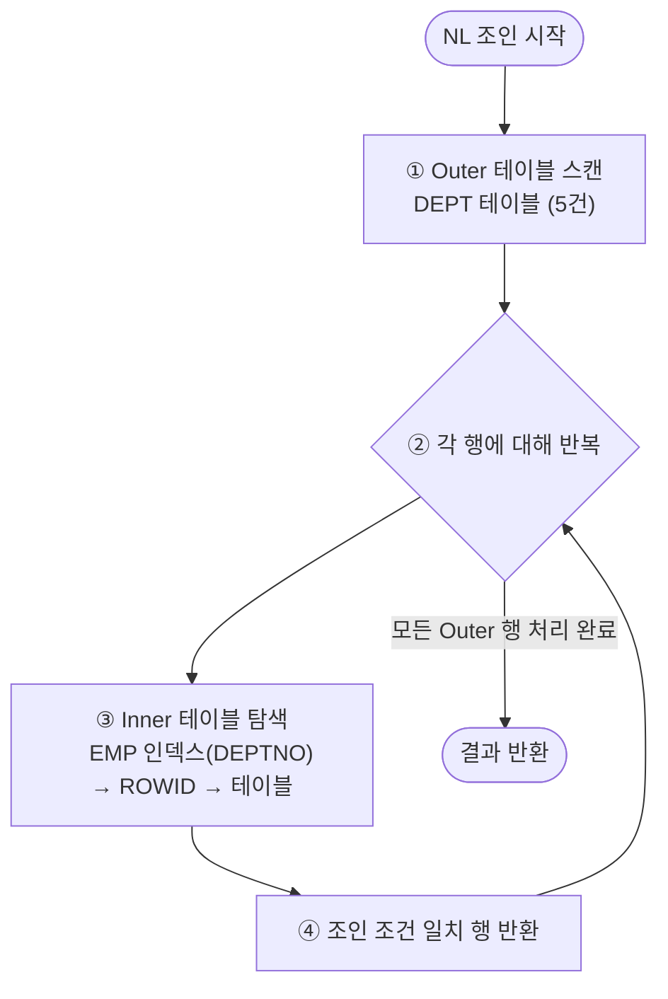

# NL 조인 (Nested Loop Join)

**NL 조인(Nested Loop Join)**은 Outer 테이블의 각 행에 대해 Inner 테이블을 반복 탐색하는 조인 방식이다.
인덱스를 활용한 소량 데이터 처리에 최적화되어 있으며, Oracle의 기본 조인 방식이다.

---

## 기본 동작 원리



NL 조인은 **이중 for문**과 동일한 구조다.

```
-- 의사 코드
FOR outer_row IN (SELECT * FROM dept WHERE loc = 'SEOUL')   -- Outer
LOOP
    FOR inner_row IN (SELECT * FROM emp WHERE deptno = outer_row.deptno)  -- Inner
    LOOP
        result.add(outer_row + inner_row);
    END LOOP;
END LOOP;
```

---

## 실행 계획과 읽기 순서

```sql
SELECT /*+ USE_NL(e) */ d.dname, e.ename, e.sal
FROM   dept d, emp e
WHERE  d.deptno = e.deptno
AND    d.loc = 'DALLAS';
```

```
실행 계획:
-----------------------------------------------------------------
| Id | Operation                    | Name          | Rows | Cost |
-----------------------------------------------------------------
|  0 | SELECT STATEMENT             |               |    5 |    7 |
|  1 |  NESTED LOOPS                |               |    5 |    7 |
|  2 |   TABLE ACCESS FULL          | DEPT          |    1 |    3 |  ← Outer (먼저 실행)
|  3 |   TABLE ACCESS BY INDEX ROWID| EMP           |    5 |    4 |  ← Inner (반복 실행)
|  4 |    INDEX RANGE SCAN          | IDX_EMP_DEPTNO|    5 |    1 |
-----------------------------------------------------------------

읽기 순서: Id=2(Outer) → Id=4(Inner 인덱스) → Id=3(Inner 테이블)
```

> 💡 실행 계획에서 **들여쓰기가 더 안쪽에 있는 것이 먼저** 실행된다.
> NL 조인에서 위쪽(Outer)이 먼저, 아래쪽(Inner)이 나중에 실행된다.

---

## Inner 테이블의 인덱스 중요성

NL 조인 성능의 핵심은 **Inner 테이블의 조인 컬럼에 인덱스**가 있느냐다.

```
[인덱스 있음] — 효율적
  DEPT(Outer) 5건 × EMP 인덱스 탐색 → 5번의 Index Range Scan
  총 I/O = Outer I/O + (Inner 인덱스 I/O × 5) + (Inner 테이블 I/O × 5)

[인덱스 없음] — 비효율적
  DEPT(Outer) 5건 × EMP Full Scan → 5번의 Full Table Scan
  총 I/O = Outer I/O + (EMP 전체 블록 × 5)
```

```sql
-- Inner 테이블 조인 컬럼에 인덱스 생성 (NL 조인 최적화)
CREATE INDEX idx_emp_deptno ON emp(deptno);
```

---

## Outer / Inner 테이블 결정

옵티마이저는 비용 기반으로 Outer/Inner를 결정하지만, **소량 데이터가 Outer**가 되어야 효율적이다.

```
좋은 NL 조인 조건:
  ① Outer 테이블의 결과 건수가 적을 것
  ② Inner 테이블의 조인 컬럼에 인덱스가 있을 것
  ③ Inner 테이블 인덱스의 클러스터링 팩터가 좋을 것
```

```sql
-- 힌트로 Outer/Inner 강제 지정
SELECT /*+ LEADING(d) USE_NL(e) */ d.dname, e.ename
FROM   dept d, emp e
WHERE  d.deptno = e.deptno;
-- LEADING(d): d를 Outer로
-- USE_NL(e): e에 대해 NL 조인 사용
```

---

## NL 조인 특성 정리

| 특성 | 내용 |
|------|------|
| 조인 방식 | Outer 행마다 Inner를 반복 탐색 |
| 인덱스 활용 | Inner 테이블 인덱스 필수 (없으면 비효율) |
| 적합한 경우 | 소량 데이터, OLTP, 부분 범위 처리 |
| 부적합한 경우 | 대용량 데이터, 배치, 집계 처리 |
| 부분 범위 처리 | 첫 번째 결과를 빠르게 반환 (ROWNUM 제한 시 유리) |
| Random Access | Inner 테이블 접근 시 ROWID 랜덤 액세스 발생 |

---

## NL 조인이 유리한 쿼리 패턴

```sql
-- 패턴 1: 소량 Outer + 인덱스 Inner
SELECT d.dname, e.ename, e.sal
FROM   dept d, emp e
WHERE  d.deptno = e.deptno
AND    d.loc = 'DALLAS';    -- DEPT 결과 1~2건 → NL 유리

-- 패턴 2: ROWNUM으로 앞 N건만 조회 (부분 범위 처리)
SELECT *
FROM  (
    SELECT d.dname, e.ename, e.sal
    FROM   dept d, emp e
    WHERE  d.deptno = e.deptno
    ORDER BY e.sal DESC
)
WHERE ROWNUM <= 10;          -- 상위 10건만 → NL + 인덱스가 빠를 수 있음
```

---

## 시험 포인트

- **NL 조인 = 이중 for문 구조**: Outer 행마다 Inner 반복 탐색
- **Inner 테이블 인덱스 필수**: 없으면 Outer 건수만큼 Full Scan 반복
- **Outer 건수가 적을수록** 유리 (Inner 반복 횟수 감소)
- **부분 범위 처리**(ROWNUM, Fetch) 시 NL 조인이 Hash/Sort Merge보다 빠를 수 있음
- **LEADING 힌트**: Outer 테이블 지정 / **USE_NL 힌트**: NL 조인 강제
- **Random Access 발생**: Inner 테이블 ROWID 접근 → 클러스터링 팩터 중요
