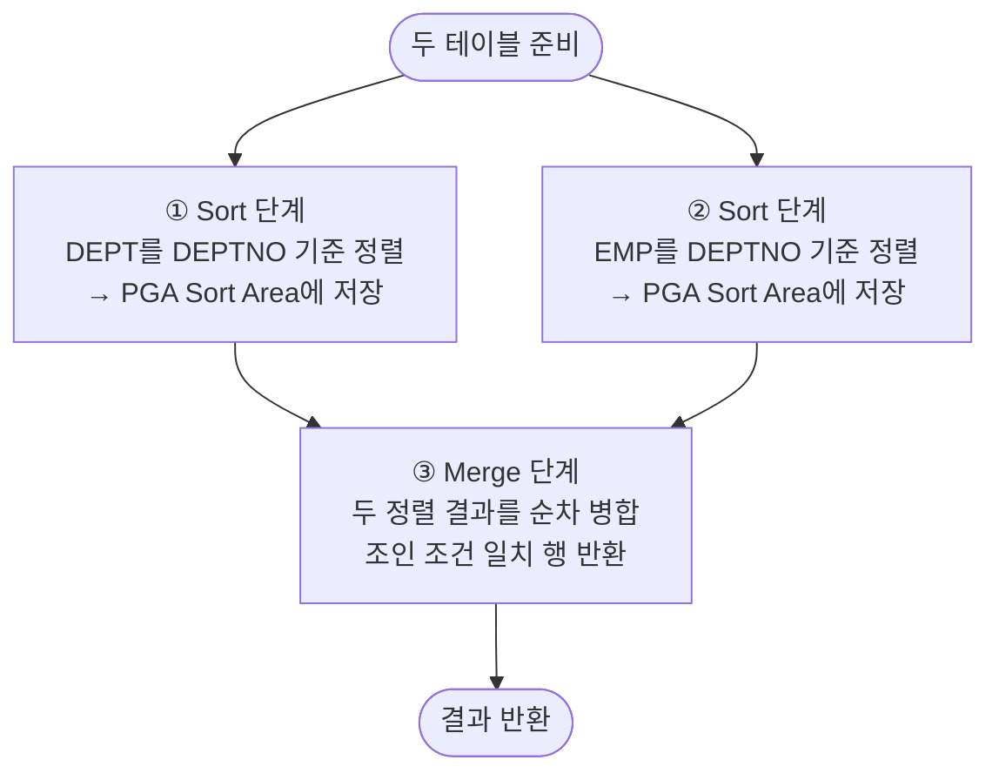

# 소트 머지 조인 (Sort Merge Join)

**소트 머지 조인(Sort Merge Join)**은 두 테이블을 조인 컬럼 기준으로 각각 정렬한 뒤, 정렬된 결과를 순차적으로 병합(Merge)하는 조인 방식이다.
인덱스 없이도 대용량 데이터를 효율적으로 처리할 수 있다.

---

## 기본 동작 원리



```
단계별 상세:

[Sort 단계]
DEPT (정렬 후):          EMP (정렬 후):
  DEPTNO=10, ACCOUNTING   DEPTNO=10, CLARK
  DEPTNO=20, RESEARCH     DEPTNO=10, KING
  DEPTNO=30, SALES        DEPTNO=20, JONES
  DEPTNO=40, OPERATIONS   DEPTNO=20, SCOTT
                          DEPTNO=30, ALLEN
                          DEPTNO=30, BLAKE

[Merge 단계] — 두 포인터를 이동하며 병합
  DEPTNO=10 → DEPT(10, ACCOUNTING) + EMP(10, CLARK)  ✓
  DEPTNO=10 → DEPT(10, ACCOUNTING) + EMP(10, KING)   ✓
  DEPTNO=20 → DEPT(20, RESEARCH)   + EMP(20, JONES)  ✓
  ...
```

---

## 실행 계획

```sql
SELECT /*+ USE_MERGE(e) */ d.dname, e.ename, e.sal
FROM   dept d, emp e
WHERE  d.deptno = e.deptno;
```

```
실행 계획:
--------------------------------------------------------------
| Id | Operation             | Name | Rows | Cost |
--------------------------------------------------------------
|  0 | SELECT STATEMENT      |      |   14 |   10 |
|  1 |  MERGE JOIN           |      |   14 |   10 |
|  2 |   SORT JOIN           |      |    4 |    4 |  ← DEPT 정렬
|  3 |    TABLE ACCESS FULL  | DEPT |    4 |    3 |
|  4 |   SORT JOIN           |      |   14 |    6 |  ← EMP 정렬
|  5 |    TABLE ACCESS FULL  | EMP  |   14 |    5 |
--------------------------------------------------------------
```

---

## 이미 정렬된 데이터의 경우 — Sort 생략

조인 컬럼에 인덱스가 있어 이미 정렬된 상태로 데이터를 읽으면 **Sort 단계를 생략**할 수 있다.

```sql
-- 인덱스(DEPTNO)가 있는 경우
-- → 인덱스 Range Scan으로 이미 정렬된 결과 → Sort 생략
SELECT d.dname, e.ename
FROM   dept d, emp e
WHERE  d.deptno = e.deptno;
```

```
실행 계획 (Sort 생략):
--------------------------------------------------------------
| Id | Operation                    | Name           |
--------------------------------------------------------------
|  0 | SELECT STATEMENT             |                |
|  1 |  MERGE JOIN                  |                |
|  2 |   TABLE ACCESS BY INDEX ROWID| DEPT           |
|  3 |    INDEX FULL SCAN           | PK_DEPT        |  ← 정렬 생략
|  4 |   SORT JOIN                  |                |  ← EMP만 정렬
|  5 |    TABLE ACCESS FULL         | EMP            |
--------------------------------------------------------------
```

---

## NL 조인 vs 소트 머지 조인

| 구분 | NL 조인 | 소트 머지 조인 |
|------|---------|---------------|
| 동작 방식 | Outer 행마다 Inner 반복 탐색 | 정렬 후 순차 병합 |
| 인덱스 의존성 | Inner 인덱스 필수 | 불필요 (있으면 Sort 생략) |
| 처리 방식 | Random Access | Sequential I/O (정렬 후) |
| 적합한 데이터 양 | 소량 | 중·대용량 |
| 부분 범위 처리 | 유리 | 불리 (전체 정렬 필요) |
| 메모리 사용 | 적음 | Sort Area 사용 (PGA) |
| 등치(=) 외 조인 | 등치만 | **등치 외 범위 조건도 가능** |

---

## 소트 머지 조인이 유리한 경우

```sql
-- 1. 대용량 조인 — 인덱스보다 정렬+병합이 효율적
SELECT d.dname, COUNT(*) AS cnt
FROM   dept d, emp e
WHERE  d.deptno = e.deptno
GROUP BY d.dname;

-- 2. 등치(=)가 아닌 조인 조건 — NL/Hash 조인 불가
SELECT e1.ename, e2.ename
FROM   emp e1, emp e2
WHERE  e1.sal < e2.sal;   -- 부등호 조인 → 소트 머지만 가능

-- 3. 이미 정렬된 데이터 (ORDER BY와 함께 사용 시)
SELECT d.dname, e.ename
FROM   dept d, emp e
WHERE  d.deptno = e.deptno
ORDER BY d.deptno;   -- 정렬 결과 재활용 가능
```

---

## PGA Sort Area와 디스크 정렬

정렬 데이터가 PGA Sort Area(`sort_area_size`)를 초과하면 **Temp 테이블스페이스(디스크)**를 사용한다.

```sql
-- Sort Area 크기 확인 (세션 레벨)
SELECT name, value
FROM   v$parameter
WHERE  name IN ('sort_area_size', 'pga_aggregate_target');

-- Temp 사용 여부 확인 (실행 후)
SELECT *
FROM   v$sql_workarea
WHERE  operation_type = 'SORT'
AND    sql_id = '...';
-- LAST_TEMPSEG_SIZE > 0 이면 디스크 정렬 발생
```

> ⚠️ 디스크 정렬(Temp 사용)이 발생하면 성능이 크게 저하된다.
> `pga_aggregate_target`을 적절히 설정하거나, 해시 조인으로 대체를 검토한다.

---

## 시험 포인트

- **동작 순서**: ① 각 테이블 정렬(Sort) → ② 병합(Merge)
- **인덱스 불필요**: 인덱스 없어도 동작하지만, 있으면 Sort 단계 생략 가능
- **등치 외 조인 가능**: `<`, `>`, `<=`, `>=` 조건 조인 시 소트 머지만 사용 가능
- **부분 범위 처리 불리**: 전체 정렬 완료 후 Merge → 첫 결과 늦게 반환
- **PGA Sort Area 초과 시 Temp 사용** → 디스크 I/O 급증 → 성능 저하
- **USE_MERGE 힌트**: 소트 머지 조인 강제 지정
