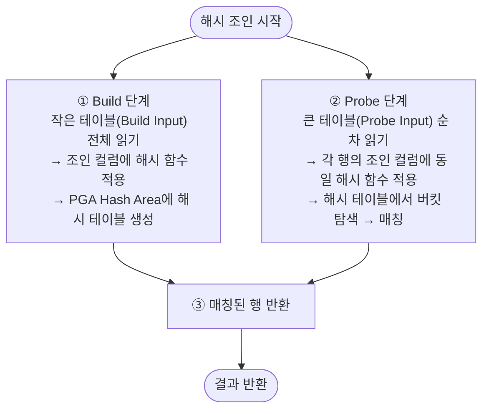

# 해시 조인 (Hash Join)

**해시 조인(Hash Join)**은 작은 테이블(Build Input)로 해시 테이블을 생성한 뒤, 큰 테이블(Probe Input)을 읽으며 해시 테이블과 매칭하는 조인 방식이다.
대용량 데이터의 등치(=) 조인에서 가장 빠른 성능을 발휘한다.

---

## 기본 동작 원리



```
예시: DEPT(4건) Build, EMP(14건) Probe

[Build 단계]
DEPT의 각 행에 해시 함수 적용:
  hash(10) = 버킷 3 → {10, ACCOUNTING, NEW YORK}
  hash(20) = 버킷 7 → {20, RESEARCH, DALLAS}
  hash(30) = 버킷 1 → {30, SALES, CHICAGO}
  hash(40) = 버킷 5 → {40, OPERATIONS, BOSTON}

[Probe 단계]
EMP 순차 읽기:
  CLARK, deptno=10 → hash(10) = 버킷 3 → ACCOUNTING 매칭 ✓
  KING,  deptno=10 → hash(10) = 버킷 3 → ACCOUNTING 매칭 ✓
  JONES, deptno=20 → hash(20) = 버킷 7 → RESEARCH 매칭   ✓
  ...
```

---

## 실행 계획

```sql
SELECT /*+ USE_HASH(e) */ d.dname, e.ename, e.sal
FROM   dept d, emp e
WHERE  d.deptno = e.deptno;
```

```
실행 계획:
-------------------------------------------------------
| Id | Operation            | Name | Rows | Cost |
-------------------------------------------------------
|  0 | SELECT STATEMENT     |      |   14 |    7 |
|  1 |  HASH JOIN           |      |   14 |    7 |
|  2 |   TABLE ACCESS FULL  | DEPT |    4 |    3 |  ← Build Input (작은 쪽)
|  3 |   TABLE ACCESS FULL  | EMP  |   14 |    4 |  ← Probe Input (큰 쪽)
-------------------------------------------------------

읽기 순서: Id=2(Build) 먼저 완료 → Id=3(Probe) 순차 읽기
```

---

## Build Input / Probe Input 결정

옵티마이저는 두 테이블 중 **결과 건수가 적은 쪽을 Build Input**으로 선택한다.

```
규칙: Build Input은 작아야 PGA Hash Area에 들어감
      Probe Input은 커도 상관없음 (순차 읽기)

[올바른 선택]
  DEPT(4건) → Build   (해시 테이블 작음 → PGA에 수용)
  EMP(14건) → Probe   (순차 읽기)

[잘못된 선택 - 힌트 오용]
  EMP(14건) → Build   (큰 해시 테이블 → Temp 디스크 사용 가능)
  DEPT(4건) → Probe
```

```sql
-- SWAP_JOIN_INPUTS: Build/Probe 순서 교체
SELECT /*+ USE_HASH(d e) SWAP_JOIN_INPUTS(e) */ d.dname, e.ename
FROM   dept d, emp e
WHERE  d.deptno = e.deptno;
-- e를 Build Input으로 강제 지정
```

---

## 세 가지 조인 방식 종합 비교

| 구분 | NL 조인 | 소트 머지 조인 | 해시 조인 |
|------|---------|---------------|-----------|
| 동작 방식 | Outer 반복 + Inner 탐색 | 정렬 후 병합 | 해시 테이블 생성 후 탐색 |
| 인덱스 의존 | Inner 필수 | 선택적 | 불필요 |
| 대용량 처리 | 비효율 | 보통 | **최적** |
| 소량 처리 | **최적** | 보통 | 오버헤드 있음 |
| 등치(=) 외 조인 | 불가 (등치만) | **가능** | 불가 (등치만) |
| 부분 범위 처리 | **유리** | 불리 | 불리 |
| 메모리 사용 | 적음 | Sort Area | Hash Area |
| 힌트 | `USE_NL` | `USE_MERGE` | `USE_HASH` |

---

## Hash Area와 디스크 해시

Build Input이 PGA Hash Area(`hash_area_size`)를 초과하면 **Temp 테이블스페이스**에 분할 저장한다 → **Grace Hash Join**.

```
[In-Memory Hash Join] — 이상적
  Build Input 전체가 PGA Hash Area에 적재
  → Probe 시 순수 메모리 탐색

[Grace Hash Join] — Temp 사용
  Hash Area 초과 → Build/Probe 모두 파티셔닝하여 Temp에 저장
  → 파티션 단위로 반복 처리
  → I/O 증가, 성능 저하
```

```sql
-- Hash Area 크기 관련 파라미터
SELECT name, value
FROM   v$parameter
WHERE  name IN ('hash_area_size', 'pga_aggregate_target');

-- Temp 사용 여부 확인
SELECT operation_type, last_tempseg_size, last_memory_used
FROM   v$sql_workarea
WHERE  sql_id = '...'
AND    operation_type = 'HASH JOIN';
-- last_tempseg_size > 0 이면 Temp 사용
```

---

## 해시 조인이 유리한 경우

```sql
-- 1. 대용량 조인 — 인덱스보다 해시가 효율적
SELECT o.order_date, COUNT(*) AS cnt, SUM(d.amount)
FROM   orders o, order_detail d
WHERE  o.order_id = d.order_id
AND    o.order_date >= '20240101'
GROUP BY o.order_date;

-- 2. 인덱스가 없는 컬럼 조인
SELECT a.col1, b.col2
FROM   table_a a, table_b b
WHERE  a.join_col = b.join_col;   -- 인덱스 없어도 OK

-- 3. 통계/배치 처리
SELECT d.deptno, d.dname, AVG(e.sal) AS avg_sal
FROM   dept d, emp e
WHERE  d.deptno = e.deptno
GROUP BY d.deptno, d.dname;
```

---

## 해시 조인 최적화 팁

```sql
-- 1. Build Input 크기를 줄이는 조건 추가
SELECT /*+ USE_HASH(e) */ d.dname, e.ename
FROM   dept d, emp e
WHERE  d.deptno = e.deptno
AND    d.loc = 'DALLAS';   -- DEPT 결과를 줄여 해시 테이블 크기 감소

-- 2. LEADING으로 작은 테이블을 Build Input으로 유도
SELECT /*+ LEADING(d) USE_HASH(e) */ d.dname, e.ename
FROM   dept d, emp e
WHERE  d.deptno = e.deptno;

-- 3. pga_aggregate_target 조정 (DBA 권한)
ALTER SYSTEM SET pga_aggregate_target = 512M;
-- 또는 세션 단위
ALTER SESSION SET hash_area_size = 104857600;  -- 100MB
```

---

## 시험 포인트

- **동작 순서**: ① Build Input으로 해시 테이블 생성 → ② Probe Input으로 매칭
- **Build Input = 작은 테이블**: PGA Hash Area에 수용되어야 최적
- **등치(=) 조인만 가능**: `<`, `>` 등 범위 조건 조인 불가 (소트 머지 사용)
- **인덱스 불필요**: Full Scan + 해시 탐색이 핵심
- **대용량 OLAP/배치에 최적**: NL 조인이 느린 상황에서 선택
- **Hash Area 초과 시 Temp 사용** → Grace Hash Join → 성능 저하
- **USE_HASH 힌트**: 해시 조인 강제 / **SWAP_JOIN_INPUTS**: Build/Probe 교체
