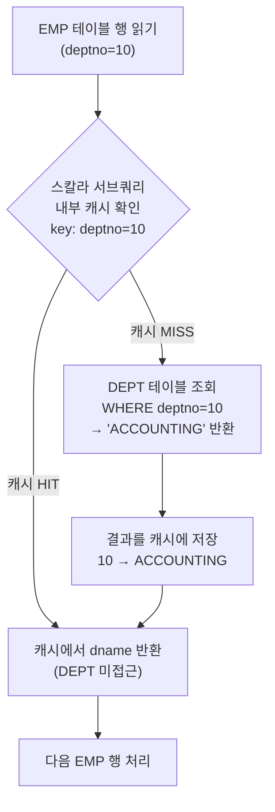

# 스칼라 서브쿼리 (Scalar Subquery)

**스칼라 서브쿼리**는 SELECT 절 또는 WHERE 절에 사용되어 **단 하나의 행, 단 하나의 컬럼**을 반환하는 서브쿼리다.
Oracle은 스칼라 서브쿼리 결과를 **내부 캐시(Hash 구조)**에 저장해 동일 입력값이 반복될 때 재사용하는 최적화를 수행한다.

---

## 기본 구조와 동작 방식

```sql
-- SELECT 절 스칼라 서브쿼리
SELECT e.empno,
       e.ename,
       e.deptno,
       (SELECT d.dname FROM dept d WHERE d.deptno = e.deptno) AS dname  -- ← 스칼라 서브쿼리
FROM   emp e;
```



---

## 캐싱 메커니즘 상세

Oracle은 스칼라 서브쿼리의 **입력값(outer 컬럼)을 key**, **반환값을 value**로 하는 해시 구조 캐시를 유지한다.

```
EMP 처리 순서:          스칼라 서브쿼리 캐시 상태:
  1. SMITH  (deptno=20) → MISS → DEPT 조회 → 캐시: {20: RESEARCH}
  2. ALLEN  (deptno=30) → MISS → DEPT 조회 → 캐시: {20: RESEARCH, 30: SALES}
  3. WARD   (deptno=30) → HIT  → 캐시에서 SALES 반환 (DEPT 미조회)
  4. JONES  (deptno=20) → HIT  → 캐시에서 RESEARCH 반환
  5. MARTIN (deptno=30) → HIT  → 캐시에서 SALES 반환
  6. BLAKE  (deptno=30) → HIT  → ...
  7. CLARK  (deptno=10) → MISS → DEPT 조회 → 캐시: {10: ACCOUNTING, 20: RESEARCH, 30: SALES}
  ...

→ DEPT 테이블 실제 접근: 4건(distinct deptno 수)만 발생
→ EMP 14건 처리 중 10번의 캐시 HIT → 10번의 DEPT 접근 절약
```

**캐시 효율 = 입력값의 중복도(카디널리티 역수)**
- deptno 종류가 4개 → 14건 처리에 4번만 실제 조회 → 효율적
- 각 행마다 unique한 값(PK) → 캐시 HIT 없음 → 비효율적

---

## 스칼라 서브쿼리 vs 조인 비교

```sql
-- 스칼라 서브쿼리 방식
SELECT e.empno, e.ename,
       (SELECT d.dname FROM dept d WHERE d.deptno = e.deptno) AS dname
FROM   emp e;

-- 조인 방식 (동일 결과)
SELECT e.empno, e.ename, d.dname
FROM   emp e, dept d
WHERE  e.deptno = d.deptno(+);   -- Outer Join (매칭 없어도 EMP 행 출력)
```

| 구분 | 스칼라 서브쿼리 | 조인 |
|------|----------------|------|
| 결과 보장 | NULL 반환 (매칭 없는 경우) | Outer 조인 필요 |
| 캐싱 | 내부 자동 캐싱 | 없음 |
| 입력값 중복 많을 때 | **유리** (캐시 HIT) | NL 조인과 유사 |
| 입력값 중복 적을 때 | 비효율 (캐시 MISS 반복) | 유리 |
| 대용량 처리 | 주의 필요 | Hash 조인으로 최적화 가능 |

---

## 스칼라 서브쿼리의 Outer Join 의미

스칼라 서브쿼리는 결과가 없으면 **NULL을 반환**하므로 자연스럽게 Outer Join처럼 동작한다.

```sql
-- 아래 두 쿼리는 결과가 동일하다
-- ① 스칼라 서브쿼리
SELECT e.empno, e.ename,
       (SELECT d.dname FROM dept d WHERE d.deptno = e.deptno) AS dname
FROM   emp e;

-- ② LEFT OUTER JOIN
SELECT e.empno, e.ename, d.dname
FROM   emp e LEFT OUTER JOIN dept d ON e.deptno = d.deptno;
```

---

## WHERE 절 스칼라 서브쿼리 (서브쿼리 필터)

```sql
-- 단일 값 반환 서브쿼리
SELECT empno, ename, sal
FROM   emp
WHERE  sal > (SELECT AVG(sal) FROM emp);   -- 평균 이상인 직원

-- 연관 서브쿼리 (Correlated Subquery)
SELECT empno, ename, sal, deptno
FROM   emp e
WHERE  sal = (SELECT MAX(sal) FROM emp WHERE deptno = e.deptno);  -- 부서별 최고 급여자
```

> ⚠️ WHERE 절 연관 서브쿼리는 Outer 행마다 반복 실행되므로 성능 주의.
> Oracle이 자동으로 세미조인(Semi Join)으로 변환하는 경우가 많다.

---

## 스칼라 서브쿼리 성능 문제와 해결

### 문제 1: 캐시 효율이 낮은 경우 (고유값 많음)

```sql
-- ❌ 문제: order_id는 PK → 캐시 HIT 없음 → 매 행마다 서브쿼리 실행
SELECT o.order_id,
       (SELECT SUM(d.amount) FROM order_detail d WHERE d.order_id = o.order_id) AS total
FROM   orders o;

-- ✅ 해결: 조인으로 변환
SELECT o.order_id, SUM(d.amount) AS total
FROM   orders o, order_detail d
WHERE  o.order_id = d.order_id(+)
GROUP BY o.order_id;
```

### 문제 2: 서브쿼리 내 함수/연산으로 캐시 키 변형

```sql
-- ❌ 캐시 키가 복잡해져 효율 저하 가능
SELECT e.ename,
       (SELECT d.dname FROM dept d WHERE d.deptno = TRUNC(e.deptno)) AS dname
FROM   emp e;

-- ✅ 가급적 단순 컬럼 값을 입력으로 사용
```

### 문제 3: 서브쿼리 내 집계로 인한 비효율

```sql
-- ❌ 매 행마다 집계 수행
SELECT e.empno, e.ename,
       (SELECT COUNT(*) FROM emp e2 WHERE e2.deptno = e.deptno) AS dept_cnt
FROM   emp e;

-- ✅ 인라인 뷰로 집계 후 조인
SELECT e.empno, e.ename, dc.dept_cnt
FROM   emp e,
       (SELECT deptno, COUNT(*) AS dept_cnt FROM emp GROUP BY deptno) dc
WHERE  e.deptno = dc.deptno;
```

---

## 스칼라 서브쿼리 캐싱 확인

```sql
-- 실행 계획에서 스칼라 서브쿼리 캐싱 여부 확인
SELECT /*+ GATHER_PLAN_STATISTICS */
       e.empno, e.ename,
       (SELECT d.dname FROM dept d WHERE d.deptno = e.deptno) dname
FROM   emp e;

SELECT * FROM TABLE(DBMS_XPLAN.DISPLAY_CURSOR(NULL, NULL, 'ALLSTATS LAST'));

-- 실행 계획에서 "FILTER"와 Starts/A-Rows로 캐싱 효과 확인
-- Starts가 적을수록 캐시 HIT 많은 것
```

---

## 시험 포인트

- **스칼라 서브쿼리 = SELECT/WHERE 절에서 단일 행·단일 컬럼 반환**
- **내부 자동 캐싱**: 입력값 동일 시 DEPT 테이블 재접근 없음
- **캐시 효율 조건**: 입력값 중복이 많을수록(카디널리티 낮을수록) 유리
- **결과 없으면 NULL 반환** → Outer Join과 동일한 효과
- **고유값이 많은 컬럼 기반 스칼라 서브쿼리** → 캐시 미활용 → 조인으로 대체 검토
- **연관 서브쿼리(WHERE 절)**: Outer 행마다 반복 → Oracle이 세미조인으로 변환하는 경우 있음
