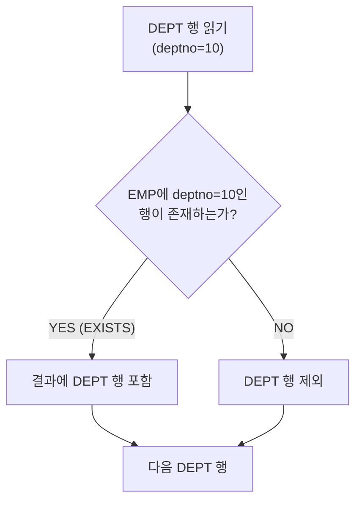

# 고급 조인 기법

기본 Inner Join 외에 **아웃터 조인(Outer Join)**, **세미 조인(Semi Join)**, **안티 조인(Anti Join)**은 SQLP 시험에서 자주 출제되는 고급 조인 기법이다.
각 조인의 동작 원리, SQL 문법, 실행 계획 특성을 정확히 이해해야 한다.

---

## 1. 아웃터 조인 (Outer Join)

**아웃터 조인**은 조인 조건을 만족하지 않는 행도 결과에 포함시키는 조인이다.
매칭되는 행이 없으면 NULL을 반환한다.

### 종류와 문법

```sql
-- ① LEFT OUTER JOIN (ANSI 표준)
-- 왼쪽 테이블의 모든 행 + 오른쪽 매칭 행 (없으면 NULL)
SELECT e.empno, e.ename, d.dname
FROM   emp e LEFT OUTER JOIN dept d ON e.deptno = d.deptno;

-- ② RIGHT OUTER JOIN
SELECT e.empno, e.ename, d.dname
FROM   emp e RIGHT OUTER JOIN dept d ON e.deptno = d.deptno;

-- ③ FULL OUTER JOIN
-- 양쪽 모두 포함 (매칭 없는 경우 양쪽 NULL)
SELECT e.empno, e.ename, d.dname
FROM   emp e FULL OUTER JOIN dept d ON e.deptno = d.deptno;

-- ④ Oracle 전통 문법 (+): LEFT OUTER JOIN
SELECT e.empno, e.ename, d.dname
FROM   emp e, dept d
WHERE  e.deptno = d.deptno(+);   -- (+)가 붙은 쪽이 NULL을 허용하는 쪽 (결과에서 빠질 수 있는 쪽)
```

### Oracle (+) 문법 주의사항

```sql
-- ❌ (+)의 위치 혼동 주의
WHERE e.deptno(+) = d.deptno   -- dept 기준 LEFT OUTER (EMP가 NULL 허용)
WHERE e.deptno = d.deptno(+)   -- emp 기준 LEFT OUTER (DEPT가 NULL 허용) ← 일반적인 용도

-- ❌ (+)는 양쪽 동시에 불가 (FULL OUTER JOIN 대체 안 됨)
WHERE e.deptno(+) = d.deptno(+)   -- 오류!

-- ✅ FULL OUTER JOIN은 ANSI 표준만 사용
SELECT e.empno, d.dname
FROM   emp e FULL OUTER JOIN dept d ON e.deptno = d.deptno;
```

### 아웃터 조인과 스칼라 서브쿼리

```sql
-- 아래 두 쿼리는 결과가 동일하다
-- ① 스칼라 서브쿼리 (암묵적 아웃터 조인)
SELECT e.empno, e.ename,
       (SELECT d.dname FROM dept d WHERE d.deptno = e.deptno) AS dname
FROM   emp e;

-- ② LEFT OUTER JOIN (명시적)
SELECT e.empno, e.ename, d.dname
FROM   emp e LEFT OUTER JOIN dept d ON e.deptno = d.deptno;
```

### 아웃터 조인 실행 계획

```
아웃터 조인 시 조인 순서가 고정된다:
- LEFT OUTER: 왼쪽(Outer) 테이블이 반드시 Driving 테이블
- Outer 테이블에 힌트로 조인 순서 변경 불가

실행 계획 예시:
| Id | Operation                     |
|  0 | SELECT STATEMENT              |
|  1 |  NESTED LOOPS OUTER           |   ← OUTER 키워드 표시
|  2 |   TABLE ACCESS FULL      EMP  |   ← Driving (Outer 테이블)
|  3 |   TABLE ACCESS BY INDEX  DEPT |   ← Driven (Inner 테이블)
|  4 |    INDEX UNIQUE SCAN     PK_DEPT|
```

---

## 2. 세미 조인 (Semi Join)

**세미 조인**은 한 테이블에서 다른 테이블에 **존재 여부**만 확인하는 조인이다.
실제 조인 결과를 반환하는 것이 아니라 조건에 맞는 Outer 행만 반환한다.

### EXISTS를 이용한 세미 조인

```sql
-- EXISTS: 서브쿼리에 매칭 행이 하나라도 있으면 TRUE
-- 부서에 직원이 있는 부서만 조회
SELECT d.deptno, d.dname
FROM   dept d
WHERE  EXISTS (SELECT 1 FROM emp e WHERE e.deptno = d.deptno);
```



### IN을 이용한 세미 조인

```sql
-- IN: 서브쿼리 결과 목록에 포함되면 TRUE
SELECT d.deptno, d.dname
FROM   dept d
WHERE  d.deptno IN (SELECT e.deptno FROM emp e);

-- EXISTS와 IN의 차이점:
-- EXISTS: 조건 만족하는 첫 번째 행 발견 즉시 중단 (효율적)
-- IN:     서브쿼리 전체 결과를 먼저 수집 후 비교
```

### 세미 조인의 실행 계획 (SEMI 키워드)

```
Oracle이 EXISTS/IN을 세미 조인으로 최적화할 때 실행 계획에 SEMI가 표시된다:

| Id | Operation              |
|  0 | SELECT STATEMENT       |
|  1 |  NESTED LOOPS SEMI     |   ← SEMI 키워드
|  2 |   TABLE ACCESS FULL DEPT |
|  3 |   INDEX RANGE SCAN   IDX_EMP_DEPTNO |

→ DEPT 행마다 EMP 인덱스에서 하나라도 찾으면 즉시 다음 DEPT 행으로 이동
→ 매칭 행 개수와 무관하게 1회 확인으로 처리 → 중복 제거 효율적
```

### EXISTS vs JOIN 비교

```sql
-- EXISTS (세미 조인) - 중복 제거 자동
SELECT d.deptno, d.dname
FROM   dept d
WHERE  EXISTS (SELECT 1 FROM emp e WHERE e.deptno = d.deptno);

-- JOIN - 중복 발생 (DEPT 30에 직원 6명이면 6행 반환)
SELECT DISTINCT d.deptno, d.dname
FROM   dept d, emp e
WHERE  d.deptno = e.deptno;   -- DISTINCT 필요

-- EXISTS는 중복 없이 Outer 테이블 기준 1행씩 반환
-- → 대용량에서 DISTINCT + JOIN보다 EXISTS가 유리
```

---

## 3. 안티 조인 (Anti Join)

**안티 조인**은 세미 조인의 반대 개념으로, 다른 테이블에 **존재하지 않는** 행만 반환한다.

### NOT EXISTS를 이용한 안티 조인

```sql
-- 직원이 없는 부서 조회
SELECT d.deptno, d.dname
FROM   dept d
WHERE  NOT EXISTS (SELECT 1 FROM emp e WHERE e.deptno = d.deptno);
```

### NOT IN을 이용한 안티 조인

```sql
-- NOT IN
SELECT d.deptno, d.dname
FROM   dept d
WHERE  d.deptno NOT IN (SELECT e.deptno FROM emp e);
```

### ⚠️ NOT IN과 NULL 주의사항

```sql
-- ❌ 치명적 함정: 서브쿼리 결과에 NULL이 하나라도 있으면 NOT IN은 항상 FALSE
-- emp.deptno에 NULL인 직원이 있다면 → 결과가 0건!
SELECT d.deptno, d.dname
FROM   dept d
WHERE  d.deptno NOT IN (SELECT e.deptno FROM emp e);   -- deptno가 NULL인 직원 있으면 0건

-- ✅ NULL이 있을 가능성이 있으면 반드시 NOT EXISTS 사용 또는 NULL 제거
SELECT d.deptno, d.dname
FROM   dept d
WHERE  NOT EXISTS (SELECT 1 FROM emp e WHERE e.deptno = d.deptno);

-- 또는 NOT IN에서 NULL 명시적 제외
WHERE  d.deptno NOT IN (SELECT e.deptno FROM emp e WHERE e.deptno IS NOT NULL);
```

### 안티 조인 실행 계획 (ANTI 키워드)

```
Oracle이 NOT EXISTS/NOT IN을 안티 조인으로 최적화할 때:

| Id | Operation              |
|  0 | SELECT STATEMENT       |
|  1 |  HASH JOIN ANTI        |   ← ANTI 키워드
|  2 |   TABLE ACCESS FULL DEPT |
|  3 |   TABLE ACCESS FULL EMP  |

또는 NL 방식:
|  1 |  NESTED LOOPS ANTI     |   ← ANTI 키워드
|  2 |   TABLE ACCESS FULL DEPT |
|  3 |   INDEX RANGE SCAN IDX_EMP_DEPTNO |
```

---

## 4. 세미 조인 vs 안티 조인 비교

| 구분 | 세미 조인 | 안티 조인 |
|------|----------|----------|
| SQL | `EXISTS`, `IN` | `NOT EXISTS`, `NOT IN` |
| 결과 | 다른 테이블에 **있는** Outer 행 | 다른 테이블에 **없는** Outer 행 |
| NULL 처리 | 영향 없음 | `NOT IN`은 NULL 주의 |
| 실행 계획 키워드 | `SEMI` | `ANTI` |
| 중복 | Outer 기준 1행 (중복 없음) | Outer 기준 1행 (중복 없음) |

---

## 5. 조인 방식 선택 기준 정리

```
조인 유형 선택 플로우:

Q1. 매칭 안 되는 행도 결과에 포함?
    YES → 아웃터 조인 (LEFT/RIGHT/FULL OUTER JOIN)
    NO  → 다음 질문

Q2. 상대 테이블의 존재 여부만 확인? (실제 컬럼 불필요)
    YES → EXISTS(세미 조인) 또는 NOT EXISTS(안티 조인)
    NO  → 일반 INNER JOIN

Q3. 상대 테이블에 없는 행만 필요?
    YES → NOT EXISTS (안티 조인) — NOT IN은 NULL 주의
    NO  → 조건에 맞는 행만 → EXISTS (세미 조인)
```

### 성능 관점에서의 선택

| 상황 | 권장 방식 | 이유 |
|------|---------|------|
| Outer 기준 1행씩 존재 확인 | `EXISTS` | 첫 번째 매칭 발견 즉시 중단 |
| 서브쿼리 결과가 소량 | `IN` | 해시/정렬 후 비교 효율적 |
| 서브쿼리 결과에 NULL 가능성 | `NOT EXISTS` | NOT IN NULL 함정 회피 |
| 대용량 Anti Join | `NOT EXISTS` | HASH JOIN ANTI로 최적화 |
| 매칭 없는 행 포함 | `LEFT OUTER JOIN` | Outer 조인 |

---

## 6. 실전 예시: 미주문 고객 찾기

```sql
-- 주문이 없는 고객 목록 조회 (안티 조인)

-- ① NOT EXISTS (권장 — NULL 안전)
SELECT c.customer_id, c.customer_name
FROM   customers c
WHERE  NOT EXISTS (
    SELECT 1 FROM orders o WHERE o.customer_id = c.customer_id
);

-- ② NOT IN (주의 — orders.customer_id에 NULL 없을 때만 안전)
SELECT c.customer_id, c.customer_name
FROM   customers c
WHERE  c.customer_id NOT IN (
    SELECT o.customer_id FROM orders o WHERE o.customer_id IS NOT NULL
);

-- ③ LEFT OUTER JOIN + IS NULL
SELECT c.customer_id, c.customer_name
FROM   customers c LEFT OUTER JOIN orders o ON c.customer_id = o.customer_id
WHERE  o.customer_id IS NULL;
-- → 매칭 없으면 o.customer_id가 NULL → 안티 조인 효과
```

---

## 시험 포인트

- **아웃터 조인**: 매칭 없으면 NULL 반환 / Oracle `(+)` = ANSI `LEFT/RIGHT OUTER JOIN`
- **`(+)` 위치**: 결과에서 NULL이 될 수 있는 테이블(조인 조건 없어도 NULL로 참여) 쪽에 붙임
- **FULL OUTER JOIN**: Oracle `(+)` 문법 불가 → ANSI 표준만 사용
- **세미 조인 (SEMI)**: EXISTS, IN → 상대 테이블 존재 여부만 확인, 중복 제거 자동
- **안티 조인 (ANTI)**: NOT EXISTS, NOT IN → 상대 테이블에 없는 행만 반환
- **NOT IN + NULL 함정**: 서브쿼리에 NULL 있으면 전체 결과 0건 → NOT EXISTS 사용 권장
- **실행 계획 키워드**: NESTED LOOPS SEMI / HASH JOIN ANTI 등으로 세미/안티 조인 확인
- **아웃터 조인 조인 순서 고정**: Outer 테이블이 반드시 Driving 테이블
