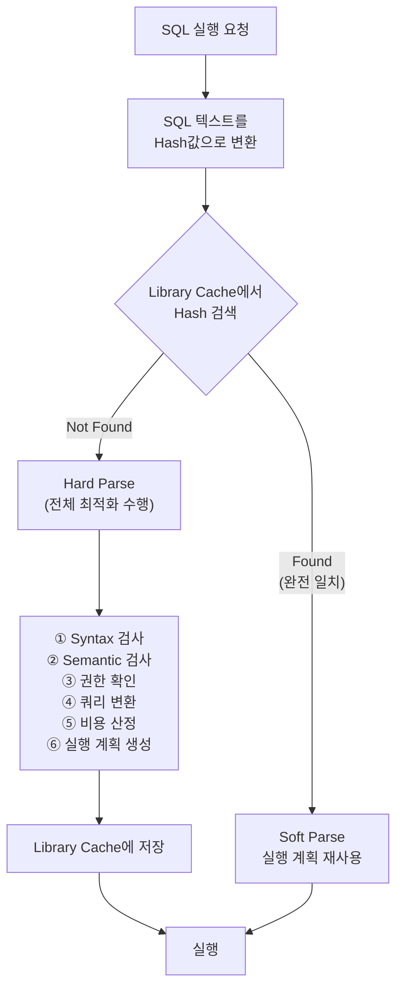

# SQL 공유 및 재사용

Oracle은 **Library Cache**에 파싱된 SQL과 실행 계획을 저장하여, 동일 SQL이 재실행될 때 파싱 비용 없이 재사용한다.
이를 **커서 공유(Cursor Sharing)**라 하며, **Hard Parse**를 줄이는 것이 성능 튜닝의 핵심 중 하나다.

---

## Library Cache 구조

```
Shared Pool
├── Library Cache
│   ├── SQL Area (커서)
│   │   ├── Parent Cursor   — SQL 텍스트 + 파싱 트리
│   │   └── Child Cursor    — 실행 계획 + 바인드 변수 메타데이터
│   ├── PL/SQL Area         — 저장 프로시저, 함수, 패키지
│   └── Dictionary Cache    — 테이블/컬럼/권한 메타데이터
└── ...
```

- **Parent Cursor**: SQL 텍스트 해시값으로 식별. 동일 텍스트 = 같은 Parent
- **Child Cursor**: 실행 환경이 다를 때(다른 스키마, NLS 설정 등) 별도 Child 생성
- 실행 계획은 Child Cursor 단위로 저장된다

---

## Hard Parse vs Soft Parse



| 구분 | Soft Parse | Hard Parse |
|------|-----------|-----------|
| 조건 | Library Cache에 동일 SQL 존재 | 처음 실행 or 캐시 만료 |
| 수행 작업 | 실행 계획 재사용만 | 전체 파싱 + 최적화 수행 |
| 비용 | 매우 낮음 | 높음 (CPU, 래치 경합 발생) |
| Library Cache Latch | 짧게 점유 | 길게 점유 |

> **Hard Parse**는 CPU와 Library Cache Latch를 과도하게 소비한다.
> 동시 접속 사용자가 많을 때 Hard Parse 폭증 → **Library Cache Latch 경합** → 성능 장애

---

## SQL 텍스트 완전 일치 조건

Library Cache에서 SQL을 찾으려면 **SQL 텍스트가 완전히 동일**해야 한다.
공백, 대소문자, 줄바꿈 하나만 달라도 Hard Parse가 발생한다.

```sql
-- ❌ 아래 4개는 모두 별개의 SQL로 처리됨 (각각 Hard Parse)
SELECT * FROM emp WHERE empno = 7369;
select * from emp where empno = 7369;          -- 대소문자 다름
SELECT  * FROM emp WHERE empno = 7369;         -- 공백 다름
SELECT * FROM emp WHERE empno = 7369 ;         -- 세미콜론 위치 다름

-- ✅ 완전히 동일한 텍스트만 Soft Parse 가능
```

---

## 바인드 변수 (Bind Variable)

**바인드 변수**는 SQL의 리터럴 값(상수)을 변수로 대체하여, 값이 달라도 동일 SQL로 인식되게 하는 기법이다.

### 리터럴 SQL vs 바인드 변수 SQL

```sql
-- ❌ 리터럴 SQL: empno마다 다른 SQL → Hard Parse 반복
SELECT * FROM emp WHERE empno = 7369;
SELECT * FROM emp WHERE empno = 7499;
SELECT * FROM emp WHERE empno = 7521;
-- → Library Cache에 3개의 별도 커서 생성

-- ✅ 바인드 변수: 값이 달라도 동일 SQL → Soft Parse 재사용
SELECT * FROM emp WHERE empno = :empno;
-- → :empno에 7369, 7499, 7521을 바인딩 → 커서 1개 공유
```

### Java에서 바인드 변수 사용

```java
// ❌ 리터럴 (Dynamic SQL) — 매번 Hard Parse
String sql = "SELECT * FROM emp WHERE empno = " + empno;
stmt = conn.createStatement();
rs = stmt.executeQuery(sql);

// ✅ 바인드 변수 (PreparedStatement) — Soft Parse 재사용
String sql = "SELECT * FROM emp WHERE empno = ?";
pstmt = conn.prepareStatement(sql);
pstmt.setInt(1, empno);   // 바인드
rs = pstmt.executeQuery();
```

### PL/SQL에서 바인드 변수 사용

```sql
-- ✅ PL/SQL의 Static SQL은 자동으로 바인드 변수 처리
DECLARE
    v_sal NUMBER;
    v_empno NUMBER := 7369;
BEGIN
    SELECT sal INTO v_sal FROM emp WHERE empno = v_empno;  -- 자동 바인드
END;
/

-- ❌ Dynamic SQL (EXECUTE IMMEDIATE)에서 리터럴 사용 → Hard Parse
EXECUTE IMMEDIATE 'SELECT sal FROM emp WHERE empno = ' || v_empno;

-- ✅ Dynamic SQL도 바인드 변수 사용 가능
EXECUTE IMMEDIATE 'SELECT sal FROM emp WHERE empno = :1' USING v_empno;
```

---

## CURSOR_SHARING 파라미터

리터럴 SQL을 자동으로 바인드 변수로 변환하는 Oracle 파라미터.

```sql
-- 현재 설정 확인
SELECT value FROM v$parameter WHERE name = 'cursor_sharing';

-- ① EXACT (기본값): 완전 일치만 공유
ALTER SESSION SET cursor_sharing = EXACT;

-- ② FORCE: 리터럴을 자동으로 바인드 변수로 변환
ALTER SESSION SET cursor_sharing = FORCE;
-- SELECT * FROM emp WHERE empno = 7369
-- → 내부적으로 SELECT * FROM emp WHERE empno = :"SYS_B_0" 로 변환

-- ③ SIMILAR (Deprecated, 11g부터 사용 중단 권고)
```

| 설정 | 동작 | 장점 | 단점 |
|------|------|------|------|
| `EXACT` | 완전 일치 시만 공유 | 정확한 실행 계획 | 리터럴 SQL Hard Parse |
| `FORCE` | 리터럴 자동 치환 | Hard Parse 감소 | 히스토그램 정보 활용 못 함 |

> `FORCE` 설정 시 히스토그램을 활용하지 못해 데이터 분포가 불균등한 쿼리에서 최적이 아닌 실행 계획이 선택될 수 있다.

---

## V$SQL로 커서 공유 현황 분석

```sql
-- 자주 실행되는 SQL과 파싱 현황 조회
SELECT sql_id,
       parse_calls,      -- 파싱 요청 수
       executions,       -- 실제 실행 수
       ROUND(parse_calls / DECODE(executions, 0, 1, executions) * 100, 2) AS parse_ratio,
       sql_text
FROM   v$sql
WHERE  executions > 100
ORDER  BY parse_calls DESC;

-- parse_calls ≈ executions → 매번 Hard Parse 발생 → 바인드 변수 미사용 의심
-- parse_calls << executions → Soft Parse 재사용 잘 되고 있음

-- Hard Parse 횟수 조회
SELECT name, value FROM v$sysstat
WHERE  name IN ('parse count (hard)', 'parse count (total)', 'execute count');
```

---

## 실행 계획 불안정 문제 (Child Cursor 폭증)

```sql
-- 동일 SQL이지만 다른 Child Cursor를 갖는 경우:
-- ① 실행 세션의 NLS_DATE_FORMAT이 다름
-- ② OPTIMIZER_MODE 파라미터가 다름
-- ③ 서로 다른 스키마에 같은 이름의 테이블 존재
-- ④ 바인드 변수 피킹(Bind Peeking) 차이 (11g에서 Adaptive Cursor Sharing으로 개선)

-- Child Cursor 수 확인
SELECT sql_id, COUNT(*) AS child_count
FROM   v$sql
GROUP  BY sql_id
HAVING COUNT(*) > 5
ORDER  BY child_count DESC;
```

---

## 세션 커서 캐시 (Session Cursor Cache)

```sql
-- SESSION_CACHED_CURSORS 파라미터: 세션 단위 커서 캐시 수
-- 자주 실행하는 SQL을 세션에 캐싱 → Soft Parse도 일부 생략 가능
SELECT value FROM v$parameter WHERE name = 'session_cached_cursors';
-- 기본값: 50

ALTER SESSION SET session_cached_cursors = 100;
```

---

## 시험 포인트

- **Library Cache**: 파싱된 SQL과 실행 계획을 저장하여 재사용 (Shared Pool 내)
- **Hard Parse**: 처음 실행 또는 캐시 만료 시 전체 파싱·최적화 수행 → 비용 높음
- **Soft Parse**: Library Cache 히트 → 실행 계획 재사용 → 비용 낮음
- **SQL 완전 일치**: 공백·대소문자 하나만 달라도 Hard Parse → **표준화 필수**
- **바인드 변수**: 리터럴 대신 `:변수명`/`?` 사용 → 값이 달라도 커서 공유
- **PL/SQL Static SQL**: 자동 바인드 변수 처리 / Dynamic SQL은 명시적 USING 필요
- **`CURSOR_SHARING = FORCE`**: 리터럴 자동 치환 → Hard Parse 감소, 단 히스토그램 활용 불가
- **`parse_calls ≈ executions`**: 바인드 변수 미사용 신호 → V$SQL로 진단
